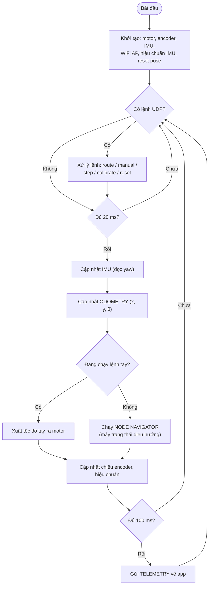
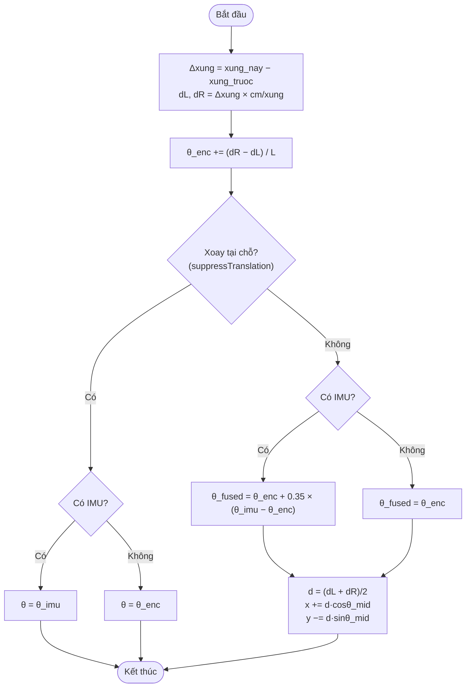
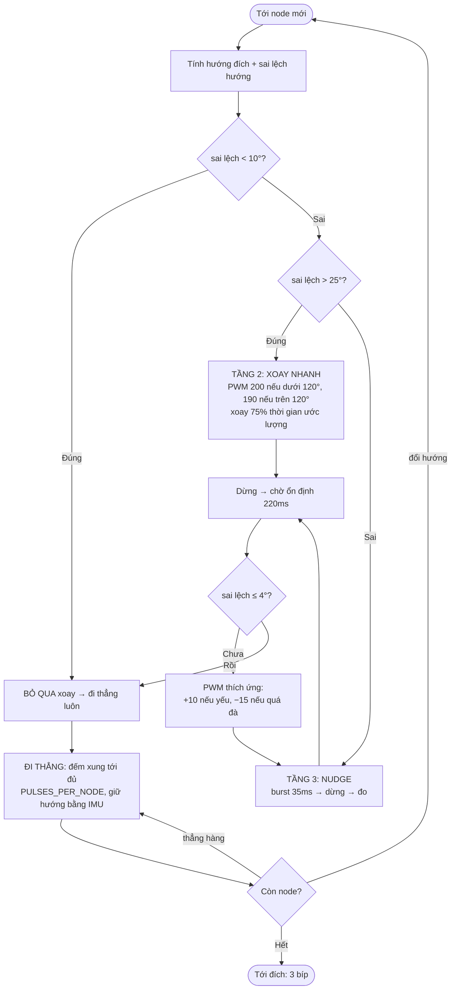
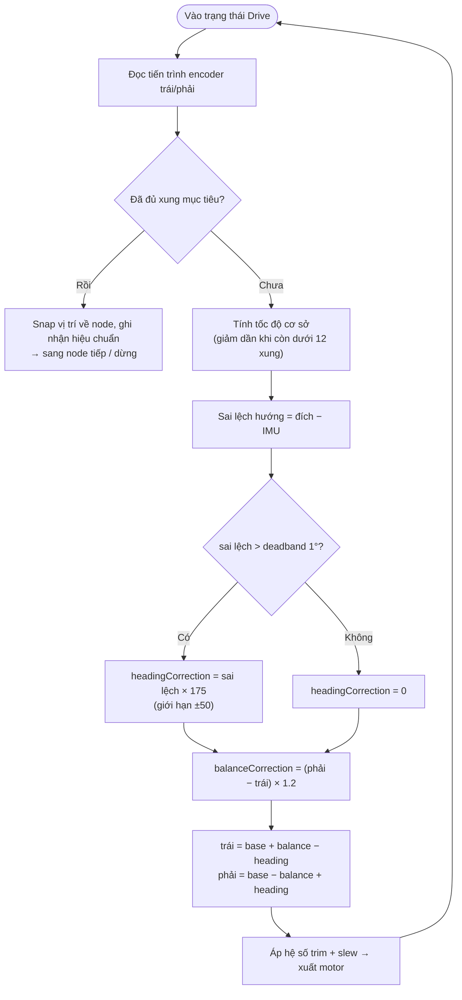
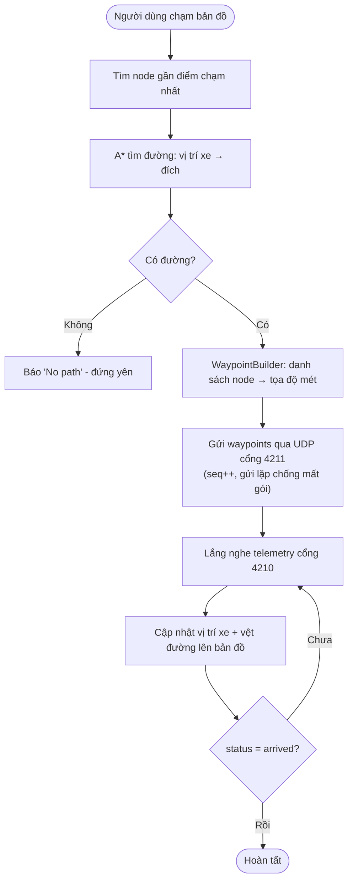

<div class="cover">
<p class="school">TRƯỜNG ĐẠI HỌC SƯ PHẠM KỸ THUẬT THÀNH PHỐ HỒ CHÍ MINH</p>
<p class="faculty">KHOA ĐIỆN - ĐIỆN TỬ<br/>NGÀNH CÔNG NGHỆ KỸ THUẬT MÁY TÍNH</p>
<p class="logo">[ CHÈN LOGO HCMUTE ]</p>
<p class="doctype">ĐỒ ÁN TỐT NGHIỆP</p>
<h1 class="cover-title">XE ROBOT TỰ HÀNH ĐỊNH VỊ BẰNG ODOMETRY VÀ TÌM ĐƯỜNG A*</h1>
<p class="major">NGÀNH CÔNG NGHỆ KỸ THUẬT MÁY TÍNH (ĐẠI TRÀ)</p>
<p class="info">Sinh viên thực hiện: Nguyễn Quốc Việt<br/>MSSV: 22119254<br/>GVHD: Th.S Nguyễn Ngô Lâm</p>
<p class="place">TP. Hồ Chí Minh – tháng 6-2025</p>
</div>

## LỜI CAM ĐOAN

Người thực hiện Nguyễn Quốc Việt xin cam đoan đề tài này là công trình nghiên cứu của bản thân tôi dựa trên những kiến thức đã được học và tích lũy được sự dẫn dắt, chỉ bảo của ThS. Nguyễn Ngô Lâm. Toàn bộ phần cứng, firmware ESP32 và ứng dụng di động Flutter trong đồ án đều do tôi tự thiết kế, lập trình và kiểm thử. Kết quả có được trong đồ án là hoàn toàn trung thực và không có sự sao chép từ các công trình nghiên cứu trước đó.

*Người thực hiện*

*Nguyễn Quốc Việt*

---

## LỜI CẢM ƠN

Để hoàn thành tốt báo cáo đồ án tốt nghiệp của ngành Công nghệ Kỹ thuật Máy tính, trước hết em xin chân thành cảm ơn đến quý Thầy/Cô trong trường Đại học Sư phạm Kỹ thuật Thành phố Hồ Chí Minh nói chung và khoa Điện - Điện tử nói riêng. Đặc biệt là thầy ThS. Nguyễn Ngô Lâm đã tận tình hướng dẫn, giúp đỡ và tạo điều kiện thuận lợi cho em trong suốt quá trình thực hiện đồ án. Em xin gửi đến thầy lời cảm ơn chân thành nhất.

Đồng thời em cũng xin gửi lời cảm ơn đến bạn bè vì đã hỗ trợ, đóng góp ý kiến trong quá trình thực hiện đề tài.

Mặc dù đã cố gắng hết sức nhưng vì kiến thức còn hạn chế, không thể tránh khỏi những thiếu sót. Do đó, em rất mong nhận được sự đóng góp ý kiến từ phía Thầy/Cô để có thể hoàn thiện tốt hơn nữa, đồng thời tích lũy thêm kinh nghiệm để đi vào thực tế sau này.

Cuối cùng, em xin chúc Thầy/Cô luôn có thật nhiều sức khỏe, luôn tràn đầy nhiệt huyết và thành công hơn nữa trong quá trình giảng dạy.

---

## TÓM TẮT

Trong thời đại công nghiệp 4.0, robot di động tự hành (Autonomous Mobile Robot) ngày càng được ứng dụng rộng rãi trong kho vận, dịch vụ và nghiên cứu. Nhằm củng cố kiến thức về hệ thống nhúng, điều khiển và lập trình ứng dụng, nhóm thực hiện đã xây dựng một **xe robot tự hành nhỏ** sử dụng vi điều khiển **ESP32** làm trung tâm điều khiển, kết hợp với một **ứng dụng di động Flutter** làm giao diện điều hành.

Hệ thống cho phép người dùng chạm chọn điểm đích trên bản đồ; ứng dụng dùng thuật toán **A\*** để tính đường đi ngắn nhất trên đồ thị waypoint, rồi gửi danh sách điểm trung gian xuống ESP32 qua giao thức **UDP** trên mạng WiFi do chính ESP32 phát ra. ESP32 bám theo lộ trình bằng cách kết hợp **odometry** từ encoder bánh xe và cảm biến góc **MPU-6050** (bộ lọc bù — complementary filter) để ước lượng vị trí và hướng theo thời gian thực, điều khiển <span class="chg">bốn động cơ DC (hai bên trái/phải)</span> qua mạch cầu **L298N**. Vị trí xe được phản hồi liên tục về ứng dụng (telemetry 10 Hz) để hiển thị trên bản đồ. Hệ thống còn tích hợp cơ chế **tự hiệu chuẩn** sai số động cơ/encoder lưu trên bộ nhớ NVS, và chế độ giả lập (simulator) để kiểm thử ứng dụng khi chưa có phần cứng.

Bên cạnh chế độ bám lộ trình theo bản đồ, hệ thống còn có **chế độ tự hành né vật cản (autonomous exploration)**: xe tự chạy thẳng, dùng cảm biến siêu âm **HC-SR04** gắn trên một **servo quét** để liên tục đo khoảng cách phía trước; khi gặp vật cản gần (dưới 30 cm) xe dừng lại, quay servo đo khoảng cách hai bên trái/phải rồi tự quyết định hướng đi thông thoáng hơn (rẽ 90° về bên rộng hơn, hoặc quay đầu 180° khi cả hai phía đều bị chặn, hoặc dừng hẳn khi bị kẹt). Người dùng bật/tắt chế độ này bằng một nút trên ứng dụng.

Thiết kế module hóa, chi phí thấp, không phụ thuộc Internet (mạng cục bộ), phù hợp làm nền tảng học thuật cho các bài toán định vị và dẫn đường robot trong quy mô phòng thí nghiệm.

---

## MỤC LỤC

- LỜI CAM ĐOAN
- LỜI CẢM ƠN
- TÓM TẮT
- MỤC LỤC
- DANH MỤC HÌNH
- DANH MỤC BẢNG BIỂU
- DANH MỤC CÁC TỪ VIẾT TẮT
- **CHƯƠNG 1: TỔNG QUAN**
  - 1.1 Giới thiệu
  - 1.2 Mục tiêu nghiên cứu
  - 1.3 Nhiệm vụ nghiên cứu
  - 1.4 Đối tượng và phạm vi nghiên cứu
  - 1.5 Phương pháp nghiên cứu
  - 1.6 Bố cục đề tài
- **CHƯƠNG 2: CƠ SỞ LÝ THUYẾT**
  - 2.1 Các giao thức kết nối sử dụng
  - 2.2 Các thuật toán và lý thuyết nền tảng
  - 2.3 Các phần mềm xây dựng và hỗ trợ
  - 2.4 Các thư viện sử dụng
- **CHƯƠNG 3: THIẾT KẾ VÀ XÂY DỰNG HỆ THỐNG**
  - 3.1 Yêu cầu và sơ đồ khối của hệ thống
  - 3.2 Thiết kế phần cứng
  - 3.3 Thiết kế phần mềm ứng dụng di động
  - 3.4 Giao thức truyền thông UDP
  - 3.5 Sơ đồ nối dây của hệ thống
  - 3.6 Lưu đồ giải thuật
- **CHƯƠNG 4: THI CÔNG HỆ THỐNG**
  - 4.1 Danh sách linh kiện
  - 4.2 Thi công phần cứng và nối dây
  - 4.3 Lập trình firmware và ứng dụng
  - 4.4 Nhận xét và đánh giá kết quả thi công
- **CHƯƠNG 5: KẾT QUẢ - NHẬN XÉT - ĐÁNH GIÁ**
- **CHƯƠNG 6: KẾT LUẬN VÀ HƯỚNG PHÁT TRIỂN**
- TÀI LIỆU THAM KHẢO
- PHỤ LỤC

---

## DANH MỤC HÌNH

| Hình | Tên hình |
|---|---|
| Hình 2.1 | Giao tiếp I2C giữa master và slave |
| Hình 2.2 | Điều chế độ rộng xung PWM |
| Hình 2.3 | Nguyên lý Trigger - Echo của HC-SR04 |
| Hình 2.4 | Mô hình xe vi sai (differential drive) |
| Hình 2.5 | Minh họa thuật toán A* trên đồ thị |
| Hình 2.6 | Giao diện PlatformIO trên VS Code |
| Hình 2.7 | Ứng dụng Flutter |
| Hình 3.1 | Sơ đồ khối hệ thống |
| Hình 3.2 | Kiến trúc tổng thể firmware - app |
| Hình 3.3 | Sơ đồ chân ESP32-WROOM-32 |
| Hình 3.4 | Kết nối ESP32 - L298N - động cơ |
| Hình 3.5 | Kết nối encoder LM393 |
| Hình 3.6 | Kết nối MPU-6050 qua I2C |
| Hình 3.7 | Kết nối cảm biến siêu âm HC-SR04 |
| Hình 3.8 | Bản đồ lưới waypoint 5×5 m |
| Hình 3.9 | Bốn màn hình ứng dụng Flutter |
| Hình 3.10 | Sơ đồ nguyên lý toàn hệ thống |
| Hình 3.11 | Lưu đồ giải thuật chính (firmware) |
| Hình 3.12 | Lưu đồ cập nhật odometry |
| Hình 3.13 | Lưu đồ điều hướng node 3 tầng xoay |
| Hình 3.14 | Lưu đồ chương trình con đi thẳng |
| Hình 3.15 | Lưu đồ luồng điều hướng trên ứng dụng |
| Hình 3.16 | Kết nối servo quét cảm biến với ESP32 |
| Hình 3.17 | Lưu đồ giải thuật chế độ tự hành né vật cản |
| Hình 4.1 | Xe robot sau khi lắp ráp hoàn chỉnh |
| Hình 4.2 | Màn hình bản đồ khi xe đang di chuyển |

> *Ghi chú: các hình ảnh chụp thực tế, sơ đồ nguyên lý và ảnh giao diện được đánh dấu **[CHÈN ẢNH ...]** trong thân báo cáo — cần chèn ảnh chụp/ảnh xuất từ phần mềm khi đóng quyển.*

---

## DANH MỤC BẢNG BIỂU

| Bảng | Tên bảng |
|---|---|
| Bảng 3.1 | Phân bổ chân GPIO của ESP32 |
| Bảng 3.2 | Thông số kỹ thuật module L298N |
| Bảng 3.3 | Bảng các giá trị nguồn của thiết bị |
| Bảng 3.4 | Các tham số điều khiển chính của firmware |
| Bảng 3.5 | Các giá trị trạng thái (status) telemetry |
| Bảng 3.6 | Các tham số chế độ tự hành né vật cản |
| Bảng 4.1 | Bảng liệt kê các linh kiện của hệ thống |
| Bảng 5.1 | Kết quả đo độ chính xác quãng đường khi đi thẳng |
| Bảng 5.2 | Kết quả đo độ chính xác xoay góc |
| Bảng 5.3 | Kết quả đánh giá khả năng giữ hướng |
| Bảng 5.4 | Kết quả điều hướng theo lộ trình node |
| Bảng 5.5 | Kết quả đo khoảng cách bằng HC-SR04 theo ba hướng quét |
| Bảng 5.6 | Kết quả thử nghiệm né vật cản tự hành |
| Bảng 5.7 | Kết quả đo độ trôi góc yaw khi đứng yên |
| Bảng 5.8 | Bảng mô tả trạng thái hoạt động của các khối |

**Danh mục công thức:**

| Công thức | Nội dung |
|---|---|
| Công thức 1 | Chu vi và quãng đường mỗi xung encoder |
| Công thức 2 | Khoảng cách từ cảm biến siêu âm |
| Công thức 3 | Chuyển đổi gyro thô sang vận tốc góc |
| Công thức 4 | Tích phân yaw từ con quay hồi chuyển |
| Công thức 5 | Góc quay vi sai từ encoder |
| Công thức 6 | Bộ lọc bù hợp nhất hướng |
| Công thức 7 | Cập nhật tọa độ (x, y) |
| Công thức 8 | Hàm chi phí và heuristic của A* |
| Công thức 9 | Số xung mục tiêu cho một đoạn đường |
| Công thức 10 | Hiệu chỉnh hướng (heading correction) khi đi thẳng |
| Công thức 11 | Cập nhật hệ số bù động cơ (motor trim) |
| Công thức 12 | Quy đổi góc servo sang độ rộng xung và duty LEDC |

---

## DANH MỤC CÁC TỪ VIẾT TẮT

| Viết tắt | Tiếng Anh | Nghĩa tiếng Việt |
|---|---|---|
| ESP32 | — | Vi điều khiển ESP32 (lõi kép, tích hợp WiFi/BLE) |
| GPIO | General Purpose Input/Output | Chân vào/ra tổng quát |
| I2C | Inter-Integrated Circuit | Giao tiếp giữa các mạch tích hợp |
| UART | Universal Asynchronous Receiver/Transmitter | Bộ thu/phát không đồng bộ |
| SPI | Serial Peripheral Interface | Giao tiếp ngoại vi nối tiếp |
| PWM | Pulse Width Modulation | Điều chế độ rộng xung |
| LEDC | LED Control (ESP32 PWM peripheral) | Bộ tạo PWM phần cứng của ESP32 |
| PID | Proportional-Integral-Derivative | Bộ điều khiển tỉ lệ - tích phân - vi phân |
| IMU | Inertial Measurement Unit | Cảm biến quán tính (gia tốc + con quay) |
| MPU | Motion Processing Unit | Vi mạch cảm biến chuyển động (MPU-6050) |
| DLPF | Digital Low-Pass Filter | Bộ lọc thông thấp số (trong MPU-6050) |
| LSB | Least Significant Bit | Bit có trọng số thấp nhất (đơn vị giá trị thô) |
| dps | degrees per second | độ trên giây (đơn vị vận tốc góc) |
| UDP | User Datagram Protocol | Giao thức truyền không kết nối |
| JSON | JavaScript Object Notation | Định dạng trao đổi dữ liệu dạng văn bản |
| AP / SoftAP | (Software) Access Point | Điểm truy cập WiFi phần mềm |
| SSID | Service Set Identifier | Tên mạng WiFi |
| IP | Internet Protocol (address) | Địa chỉ giao thức Internet |
| NVS | Non-Volatile Storage | Bộ nhớ không mất dữ liệu (flash của ESP32) |
| ISR | Interrupt Service Routine | Chương trình phục vụ ngắt |
| A* | A-star algorithm | Thuật toán tìm đường A-sao |
| DC | Direct Current | Dòng điện một chiều (động cơ DC) |
| RPM | Revolutions Per Minute | Số vòng quay mỗi phút |
| ToF | Time of Flight | Cảm biến đo thời gian bay (laser) |
| PCB | Printed Circuit Board | Bảng mạch in |
| IDE | Integrated Development Environment | Môi trường phát triển tích hợp |

---
---

# CHƯƠNG 1: TỔNG QUAN

## 1.1 GIỚI THIỆU

Robot di động tự hành (Autonomous Mobile Robot – AMR) đang trở thành một trong những hướng công nghệ phát triển nhanh nhất, gắn liền với làn sóng tự động hóa và cuộc Cách mạng công nghiệp 4.0. Khác với robot cố định hay xe dẫn đường tự động (AGV) truyền thống vốn bám theo vạch từ/băng dẫn cố định, AMR có khả năng tự định vị, tự lập kế hoạch đường đi và tự điều hướng trong môi trường, nhờ đó được ứng dụng ngày càng rộng rãi trong kho vận thông minh (intralogistics), robot dịch vụ, y tế, nông nghiệp và các nền tảng nghiên cứu [10], [15]. Nhiều khảo sát cho thấy việc thay thế AGV cứng nhắc bằng AMR linh hoạt giúp tăng đáng kể năng suất và khả năng thích ứng của dây chuyền sản xuất trong mô hình nhà máy thông minh [15].

Dù đa dạng về hình thức, mọi robot tự hành đều phải giải quyết ba bài toán cốt lõi: **định vị** (robot biết mình đang ở đâu), **lập kế hoạch đường đi** (xác định lộ trình tới đích) và **điều khiển bám lộ trình** (di chuyển chính xác theo lộ trình đó) [10]. Về định vị, phương pháp tương đối (dead-reckoning) dựa trên odometry từ encoder bánh xe đơn giản, rẻ và tần số cao nhưng sai số tích lũy (trôi) theo quãng đường do trượt bánh và đường kính bánh không đều [11]; phương pháp tuyệt đối dùng GPS hoặc mốc định vị (landmark/beacon), còn các kỹ thuật hiện đại như định vị và dựng bản đồ đồng thời (SLAM) bằng LiDAR/camera cho độ chính xác cao nhưng đòi hỏi cảm biến đắt tiền và năng lực tính toán lớn [16].

Để giảm trôi của odometry, nhiều nghiên cứu đã hợp nhất encoder với cảm biến quán tính (IMU). Al Khatib và cộng sự [33] hợp nhất nhiều cảm biến (odometry, IMU) bằng bộ lọc Kalman mở rộng (EKF), nâng cao rõ rệt độ chính xác định vị và dẫn đường so với chỉ dùng đơn cảm biến. Cùng hướng đó, Ly và cộng sự [34] hợp nhất dữ liệu IMU và encoder bằng bộ lọc Kalman cho robot di động, cho thấy vị trí ước lượng bám quỹ đạo thực sát hơn hẳn odometry thuần; Housein và cộng sự [35] trình bày một triển khai EKF thực nghiệm cho cùng bài toán. Các hướng mở rộng gần đây còn kết hợp thêm thị giác (wheel–inertial–visual) bằng biến thể bộ lọc Kalman để tăng độ bền vững [36]. Tuy nhiên, bộ lọc Kalman/EKF đòi hỏi mô hình và khối lượng tính toán đáng kể; với vi điều khiển hạn chế tài nguyên, **bộ lọc bù (complementary filter)** là giải pháp nhẹ hơn, đủ tốt để kết hợp con quay hồi chuyển và encoder nhằm ổn định ước lượng hướng [14].

Về bài toán tìm đường, lý thuyết đồ thị cung cấp nền tảng vững chắc: thuật toán Dijkstra tìm đường đi ngắn nhất trên đồ thị có trọng số [13], còn thuật toán **A\*** mở rộng Dijkstra bằng một hàm heuristic để hướng việc tìm kiếm về phía đích, nhờ đó giảm mạnh số nút phải duyệt mà vẫn đảm bảo tối ưu khi heuristic chấp nhận được (admissible) [6]. Bên cạnh nhóm dựa trên đồ thị/lưới còn có nhóm lấy mẫu ngẫu nhiên (RRT, PRM) cho không gian cấu hình nhiều chiều [12]. Trong thực tiễn robot, A\* vẫn là lựa chọn phổ biến và liên tục được cải tiến: Shahapur và cộng sự [38] hiện thực và so sánh A\* với Dijkstra trên robot TurtleBot3 (mô phỏng Gazebo), xác nhận A\* tìm được đường tối ưu với số nút duyệt ít hơn; Yao và cộng sự [37] đề xuất biến thể A\* cải tiến (BSGA\*) cho robot vi sai nhằm khắc phục đúng các hạn chế của A\* gốc là số nút tìm kiếm lớn và đường đi kém mượt. Với môi trường trong nhà đã biết trước dưới dạng lưới điểm (waypoint), A\* là lựa chọn cân bằng tốt giữa tính tối ưu, tốc độ thực thi và độ đơn giản khi cài đặt trên thiết bị di động.

Song song với định vị và tìm đường, khả năng **né vật cản** cũng được nghiên cứu theo hướng chi phí thấp. Yasin và cộng sự [39] đề xuất phương pháp phát hiện vật cản và tránh va chạm chỉ dùng cảm biến siêu âm giá rẻ, với mục tiêu tối thiểu hóa độ lệch khỏi lộ trình ban đầu — rất phù hợp cho robot ngân sách thấp. Ở quy mô công nghiệp, robot tự hành thường được trang bị cảm biến đắt tiền (LiDAR, camera độ phân giải cao, GPS-RTK) cùng máy tính mạnh để chạy SLAM và thị giác máy tính [16]; nhưng chi phí và độ phức tạp đó là rào cản lớn đối với sinh viên và các dự án học thuật. Vì vậy, hướng xây dựng robot tự hành **chi phí thấp** dựa trên vi điều khiển phổ thông ngày càng được quan tâm — tiêu biểu là ESP32, vi điều khiển lõi kép tích hợp sẵn WiFi/Bluetooth, giá rẻ, cộng đồng hỗ trợ lớn, phù hợp cho các ứng dụng IoT và robot nhỏ [17].

Từ tổng quan trên có thể thấy các kỹ thuật định vị (hợp nhất encoder–IMU), tìm đường (A\*) và né vật cản đều đã tương đối hoàn thiện, nhưng phần lớn được kiểm chứng trên nền tảng mạnh (PC/ROS, robot chuẩn như TurtleBot3) [38] hoặc bằng các bộ lọc tính toán nặng như EKF [33], [35]. Vẫn còn thiếu những giải pháp **tích hợp trọn vẹn** cả ba chức năng định vị – tìm đường – bám lộ trình lên một vi điều khiển chi phí thấp, hoạt động độc lập không cần Internet và dễ tiếp cận cho mục đích học tập. Xây dựng một nền tảng như vậy vừa mang ý nghĩa thực tiễn — là sản phẩm học tập giúp người thực hiện nắm vững trọn vẹn chuỗi kiến thức nền (điều khiển động cơ, đọc cảm biến, định vị, lập kế hoạch đường đi, truyền thông không dây) — vừa là khung sườn để phát triển tiếp các tính năng cao cấp hơn như tránh vật cản động, SLAM hay phối hợp đội hình nhiều robot.

Xuất phát từ những lý do đó, đề tài **"Xe robot tự hành định vị bằng odometry và tìm đường A\*"** được lựa chọn thực hiện. Đề tài dùng ESP32 làm bộ điều khiển trung tâm; định vị bằng odometry kết hợp encoder bánh xe và cảm biến góc MPU-6050 thông qua bộ lọc bù [14]; tìm đường bằng thuật toán A\* [6] chạy trên ứng dụng di động đa nền tảng viết bằng Flutter [9]; và liên lạc thời gian thực giữa ứng dụng với xe qua giao thức UDP trên mạng WiFi cục bộ do chính ESP32 phát ra. Việc chọn Flutter và mạng cục bộ giúp hệ thống đa nền tảng, độ trễ thấp và hoạt động độc lập với Internet. Toàn bộ hệ thống được thiết kế theo hướng module hóa, chi phí thấp và có khả năng mở rộng, hướng tới một nền tảng học thuật hoàn chỉnh cho các bài toán định vị và dẫn đường robot ở quy mô phòng thí nghiệm.

## 1.2 MỤC TIÊU NGHIÊN CỨU

**Mục tiêu lớn:** Thiết kế và xây dựng một xe robot tự hành sử dụng vi điều khiển ESP32, có khả năng tự định vị, tự tìm đường và bám theo lộ trình tới điểm đích do người dùng chọn trên ứng dụng di động.

**Mục tiêu cụ thể — các kết quả dự kiến đạt được:**

*Về phần cứng:*
- Hoàn thiện cơ khí xe robot <span class="chg">**bốn bánh dẫn động vi sai (skid-steer)**: khung xe bốn bánh, bốn động cơ DC giảm tốc chia hai bên trái/phải, mỗi bên gắn một **encoder quang** đo tốc độ.</span>
- Lắp và đấu nối khối điện tử quanh **ESP32**: mạch lái **L298N** <span class="chg">(2 kênh) + 4 động cơ</span>, **IMU MPU-6050** (I2C), **HC-SR04** gắn trên **servo quét**, buzzer; cấp nguồn pin qua module ổn áp.
- Đi dây và bố trí **chống nhiễu** (tách dây tín hiệu/động lực, nối chung mass) để hệ thống chạy ổn định.

*Về phần mềm:*
- **Firmware ESP32 module hóa**: điều khiển động cơ (PWM/cầu H), đọc encoder bằng ngắt, đọc IMU + siêu âm, ước lượng **odometry vi sai** kết hợp **bộ lọc bù** IMU.
- **Máy trạng thái điều hướng node**: tự xoay đúng hướng và đi thẳng đúng quãng đường giữa các node, có giữ hướng + cân bằng <span class="chg">hai bên</span>; **tự hiệu chuẩn** (cân bằng động cơ, tỉ lệ encoder) lưu qua các lần khởi động.
- **Né vật cản**: chế độ tự hành (siêu âm + servo quét, tự rẽ tránh) và né vật cản động khi bám lộ trình (chặn cạnh trên bản đồ + tính lại đường bằng A\*).
- **Ứng dụng di động Flutter**: hiển thị bản đồ lưới waypoint, tính đường đi ngắn nhất bằng **A\***, gửi lộ trình và hiển thị vị trí xe + trạng thái theo thời gian thực; có chế độ **giả lập** chạy không cần phần cứng.
- **Giao thức truyền thông UDP** độ trễ thấp (lệnh + telemetry) kèm chia mảnh lộ trình và chống trùng gói.

## 1.3 NHIỆM VỤ NGHIÊN CỨU

Trong quá trình thực hiện, đề tài tập trung vào các nhiệm vụ chính: khảo sát và phân tích các phương pháp định vị/dẫn đường cho robot di động; nghiên cứu các loại cảm biến phù hợp với ESP32; thiết kế sơ đồ khối và mạch nguyên lý của hệ thống; lập trình điều khiển động cơ và đọc cảm biến; cài đặt thuật toán odometry và bộ lọc bù; cài đặt thuật toán A\* và bộ dựng waypoint trên ứng dụng; thiết kế giao thức UDP và cơ chế telemetry; kiểm thử hệ thống thực tế; đo đạc, tinh chỉnh tham số và đánh giá sai số; đề xuất hướng cải tiến.

## 1.4 ĐỐI TƯỢNG VÀ PHẠM VI NGHIÊN CỨU

**Đối tượng nghiên cứu:** hệ thống xe robot tự hành <span class="chg">bốn bánh dẫn động vi sai kiểu skid-steer (differential drive)</span> sử dụng ESP32 làm trung tâm điều khiển, định vị bằng odometry encoder kết hợp IMU, dẫn đường bằng A\* trên đồ thị waypoint.

**Phạm vi nghiên cứu:**

- **Giới hạn về phần cứng:** Hệ thống được triển khai trên mô hình xe robot di động <span class="chg">bốn bánh dẫn động vi sai kiểu skid-steer (differential drive)</span>, sử dụng vi điều khiển ESP32 làm bộ xử lý trung tâm. Các thành phần phần cứng bao gồm <span class="chg">bốn động cơ DC (chia hai bên trái/phải), encoder đo tốc độ bánh xe ở mỗi bên</span>, cảm biến IMU và mạch điều khiển động cơ L298N.
- **Giới hạn về phương pháp định vị:** Vị trí và hướng di chuyển của robot được ước lượng dựa trên phương pháp odometry encoder kết hợp dữ liệu IMU. Đề tài chỉ tập trung vào định vị tương đối (dead-reckoning), không nghiên cứu các phương pháp định vị tuyệt đối như GPS hoặc các hệ thống định vị ngoài.
- **Giới hạn về thuật toán dẫn đường:** Thuật toán tìm đường được giới hạn ở thuật toán A\* trên đồ thị waypoint được xây dựng trước. Robot thực hiện di chuyển theo lộ trình đã xác định, chưa xử lý bài toán lập kế hoạch đường đi trong môi trường chưa biết hoặc thay đổi theo thời gian.
- **Giới hạn về môi trường thử nghiệm:** Hệ thống được thử nghiệm trong môi trường trong nhà với diện tích giới hạn khoảng 5×5 m, mặt sàn phẳng, ít thay đổi về điều kiện hoạt động. Bản đồ môi trường được biết trước và biểu diễn dưới dạng lưới điểm phục vụ quá trình dẫn đường.
- **Giới hạn về mô phỏng kịch bản hoạt động:** Các kịch bản đánh giá tập trung vào khả năng di chuyển đến vị trí mục tiêu, bám theo quỹ đạo đã lập và đánh giá sai số định vị trong điều kiện môi trường kiểm soát. Đề tài chưa xét đến các trường hợp phức tạp như vật cản động, thay đổi bản đồ hoặc nhiều robot phối hợp.
- **Các công nghệ chưa được xem xét:** Đề tài không sử dụng các công nghệ định vị và nhận thức môi trường nâng cao như LiDAR, camera AI, GPS hoặc thuật toán SLAM xây dựng bản đồ đồng thời.

## 1.5 PHƯƠNG PHÁP NGHIÊN CỨU

Đề tài sử dụng kết hợp các phương pháp: **phân tích - tổng hợp tài liệu** từ các nguồn học thuật và datasheet linh kiện; **mô phỏng - thực nghiệm** (chế độ simulator của ứng dụng cho phép kiểm thử phần mềm trước khi có phần cứng); **tính toán kỹ thuật điện tử** (lựa chọn linh kiện, tính toán quãng đường/góc quay, hiệu chỉnh sai số); và **lập trình nhúng** trên ESP32 (C++ với PlatformIO) song song với **lập trình ứng dụng** (Dart/Flutter). Hệ thống được phát triển theo từng giai đoạn (phase) và kiểm thử đơn vị (unit test) cho các module thuật toán quan trọng.

## 1.6 BỐ CỤC ĐỀ TÀI

Đồ án được chia làm 6 chương như sau:

**Chương 1: Tổng quan** – Giới thiệu chung, nêu tính cấp thiết, xác định mục tiêu, đối tượng, phạm vi và phương pháp nghiên cứu.

**Chương 2: Cơ sở lý thuyết** – Trình bày các chuẩn giao tiếp (GPIO, I2C, PWM, Trigger-Echo, ngắt, WiFi/UDP), các thuật toán nền tảng (odometry vi sai, bộ lọc bù, A\*), các phần mềm và thư viện sử dụng.

**Chương 3: Thiết kế và xây dựng hệ thống** – Từ yêu cầu, đưa ra sơ đồ khối, thiết kế phần cứng từng khối, kiến trúc phần mềm ứng dụng, giao thức UDP, sơ đồ nối dây và các lưu đồ giải thuật.

**Chương 4: Thi công hệ thống** – Liệt kê linh kiện, lắp ráp phần cứng, nối dây, lập trình firmware và ứng dụng.

**Chương 5: Kết quả - Nhận xét - Đánh giá** – Trình bày kết quả lý thuyết và thực hành, đánh giá hoạt động của từng khối.

**Chương 6: Kết luận và hướng phát triển** – Tổng kết ưu/nhược điểm và đề xuất hướng cải thiện, phát triển hệ thống.

---
---

# CHƯƠNG 2: CƠ SỞ LÝ THUYẾT

## 2.1 CÁC GIAO THỨC KẾT NỐI SỬ DỤNG

### 2.1.1 GPIO

GPIO (General Purpose Input/Output) là các chân tín hiệu được cấu hình bằng phần mềm để thực hiện chức năng ngõ vào (input) hoặc ngõ ra (output). Trong đề tài, GPIO của ESP32 được dùng cho hầu hết các kết nối số: điều khiển chiều quay động cơ (các chân IN1–IN4 của L298N), phát xung trigger cho cảm biến siêu âm, điều khiển còi buzzer, và đọc tín hiệu xung từ encoder.

ESP32 sử dụng mức logic **3.3 V** [18]. Mỗi chân GPIO có thể cấu hình kéo lên (pull-up)/kéo xuống (pull-down) nội bộ, và quan trọng nhất với đề tài là khả năng tạo **ngắt ngoài** (interrupt) khi có cạnh tín hiệu — được dùng để đếm xung encoder. Cần lưu ý một số chân của ESP32 chỉ có chức năng input (GPIO34, GPIO35, GPIO36, GPIO39 — không có điện trở kéo nội bộ); trong đề tài chân **GPIO34** và **GPIO32** được chọn làm ngõ vào đọc encoder.

### 2.1.2 I2C

I2C (Inter-Integrated Circuit) [19] là giao thức truyền thông nối tiếp đồng bộ, sử dụng hai đường:
- **SDA (Serial Data Line):** đường dữ liệu hai chiều.
- **SCL (Serial Clock Line):** đường xung nhịp do master cung cấp.

Hệ thống I2C gồm một master (ESP32) điều khiển bus và một hoặc nhiều slave được gán địa chỉ. Trong đề tài, I2C dùng để giao tiếp với cảm biến quán tính **MPU-6050** (địa chỉ mặc định **0x68**, hoặc 0x69 khi chân AD0 ở mức cao). ESP32 đặt chân **GPIO21 = SDA**, **GPIO22 = SCL** và chạy bus ở tốc độ 50 kHz để đảm bảo ổn định khi đi dây dài và có nhiễu từ động cơ.

> **[CHÈN HÌNH 2.1 — Sơ đồ giao tiếp I2C giữa master và các slave]**

### 2.1.3 PWM và bộ LEDC của ESP32

PWM (Pulse Width Modulation – điều chế độ rộng xung) [20] điều khiển công suất trung bình cấp cho tải bằng cách thay đổi tỉ lệ thời gian mức cao/thấp của tín hiệu (duty cycle). Tốc độ động cơ DC tỉ lệ với duty cycle của tín hiệu PWM cấp vào chân Enable của mạch cầu H.

ESP32 có bộ ngoại vi **LEDC** [8] chuyên tạo PWM phần cứng (không tốn CPU). Trong đề tài, hai kênh LEDC (kênh 0 cho bánh trái, kênh 1 cho bánh phải) được cấu hình **tần số 5 kHz, độ phân giải 8-bit** (duty 0–255), gắn vào hai chân Enable ENA/ENB của L298N. Giá trị PWM 0 là dừng, 255 là tốc độ tối đa.

Bộ LEDC còn được dùng để **điều khiển servo** quét cảm biến: một kênh LEDC riêng (kênh 2) được cấu hình **tần số 50 Hz, độ phân giải 16-bit** — đúng chuẩn tín hiệu servo RC (chu kỳ 20 ms, độ rộng xung 0,5–2,5 ms tương ứng góc 0–180°). Việc dùng kênh và bộ định thời (timer) tách biệt với hai kênh động cơ giúp servo và motor hoạt động đồng thời mà không xung đột tần số.

> **[CHÈN HÌNH 2.2 — Minh họa các mức duty cycle của tín hiệu PWM]**

### 2.1.4 Trigger - Echo (cảm biến siêu âm)

Cảm biến siêu âm HC-SR04 đo khoảng cách theo nguyên lý phản hồi sóng âm với hai chân:
- **Trigger:** ngõ vào, vi điều khiển phát một xung mức cao **10 µs** để bắt đầu phép đo.
- **Echo:** ngõ ra, trả về một xung có độ rộng tỉ lệ với thời gian sóng âm đi tới vật cản và phản xạ về.

ESP32 đo độ rộng xung Echo (bằng hàm `pulseIn`) rồi suy ra khoảng cách. Vận tốc âm thanh trong không khí xấp xỉ 343 m/s (0,0343 cm/µs); vì sóng đi và về nên quãng đường tính được phải chia 2:

> **Công thức 2:**
>
> **Distance (cm) = [ t_echo(µs) × 0,0343 ] / 2 = t_echo(µs) / 58,3**

> **[CHÈN HÌNH 2.3 — Nguyên lý Trigger - Echo của HC-SR04]**

### 2.1.5 Ngắt ngoài và đọc encoder

Encoder bánh xe tạo ra một chuỗi xung khi bánh quay. Để không bỏ sót xung khi vi điều khiển đang bận, đề tài dùng **ngắt ngoài (external interrupt)**: mỗi cạnh lên (RISING) trên chân encoder kích hoạt một ISR (Interrupt Service Routine) tăng bộ đếm xung. ISR được đặt trong RAM nội (`IRAM_ATTR`) để thực thi nhanh.

Do encoder quang LM393 một kênh (chỉ có ngõ D0) không cho biết chiều quay, firmware **lấy chiều quay từ lệnh điều khiển động cơ** (motor đang tiến thì xung cộng, lùi thì xung trừ). Để lọc nhiễu điện từ (EMI) do động cơ gây ra, ISR áp dụng **chống dội phần mềm**: bỏ qua các xung cách nhau dưới **6000 µs** (cho phép tối đa ~166 xung/s, dư biên rộng so với tốc độ chạy thực tế chỉ vài chục xung/s). Ngưỡng này còn lọc các **cạnh giả** do comparator LM393 (thiếu hysteresis) [21] sinh ra ở mép khe đĩa.

### 2.1.6 WiFi và giao thức UDP

ESP32 tích hợp WiFi [22], có thể hoạt động ở chế độ **Access Point (SoftAP)** — tự phát ra một mạng WiFi để điện thoại kết nối trực tiếp, không cần router. Đề tài dùng chế độ này để tạo mạng cục bộ độ trễ thấp, hoạt động độc lập không cần Internet.

Trên mạng đó, dữ liệu được trao đổi bằng **UDP (User Datagram Protocol)** [23] — giao thức không kết nối, không bắt tay, không đảm bảo thứ tự/độ tin cậy nhưng **độ trễ rất thấp**, rất phù hợp cho điều khiển robot thời gian thực: telemetry vị trí gửi 10 lần/giây có thể chấp nhận mất vài gói, còn lệnh quan trọng (lộ trình) được gửi lặp lại nhiều lần để bù.

## 2.2 CÁC THUẬT TOÁN VÀ LÝ THUYẾT NỀN TẢNG

### 2.2.1 Mô hình xe vi sai và odometry

Xe robot trong đề tài <span class="chg">**dẫn động vi sai kiểu skid-steer (differential drive)**</span> [25], [30]: <span class="chg">bốn bánh chia thành hai bên trái/phải, mỗi bên do một nhóm hai động cơ điều khiển độc lập</span>, hướng xe thay đổi nhờ chênh lệch tốc độ <span class="chg">hai bên</span>. <span class="chg">Mỗi bên có một encoder đo quãng đường.</span> **Odometry** (đo hành trình) [7], [24] là phương pháp ước lượng vị trí robot bằng cách tích lũy quãng đường <span class="chg">hai bên</span> đo được từ encoder. <span class="chg">(Xe bốn bánh skid-steer có hiện tượng trượt ngang khi xoay, được bù bằng IMU — xem mục 2.2.2.)</span>

Gọi **dL**, **dR** là quãng đường <span class="chg">bên</span> trái/phải đi được trong một chu kỳ, **L** là khoảng cách giữa <span class="chg">hai vệt bánh trái–phải (track width)</span>. Khi đó:
- Quãng đường tịnh tiến trung tâm xe: **d = (dL + dR) / 2**
- Góc quay của xe: **Δθ = (dR − dL) / L**

Cập nhật vị trí theo hệ trục (lưu ý hệ tọa độ của bản đồ có trục Y hướng xuống):
- **x += d × cos(θ_mid)**
- **y −= d × sin(θ_mid)**

với **θ_mid** là hướng trung bình trong chu kỳ. Quãng đường mỗi xung encoder quy đổi qua chu vi bánh xe (xem Công thức 1, mục 3.2.3).

> **[CHÈN HÌNH 2.4 — Mô hình động học xe vi sai]**

### 2.2.2 Bộ lọc bù (Complementary Filter)

Odometry chỉ dựa trên encoder sẽ tích lũy sai số hướng rất nhanh (trượt bánh, đường kính bánh không đều). Ngược lại, con quay hồi chuyển (gyro) của IMU đo vận tốc góc rất tốt trong ngắn hạn nhưng bị **trôi (drift)** khi tích phân lâu dài. **Bộ lọc bù** [14] kết hợp hai nguồn để bù khuyết điểm của nhau (một lựa chọn thay thế phức tạp hơn là **bộ lọc Kalman** [26], [27]):

> **θ_fused = θ_enc + α × (θ_imu − θ_enc)**

Hệ số **α = 0,35** được chọn để **encoder làm chủ hướng (65%)** còn **IMU hiệu chỉnh (35%)**. Đây là lựa chọn thực nghiệm: encoder cho hướng ổn định khi đi thẳng, IMU kéo lại sai lệch khi bánh trượt. Trường hợp đặc biệt: khi **xoay tại chỗ** (<span class="chg">hai bên quay ngược chiều, bánh trượt ngang nên</span> encoder không đáng tin) thì dùng **IMU 100%**; khi **IMU mất kết nối** thì dùng **encoder 100%** làm phương án dự phòng.

### 2.2.3 Thuật toán tìm đường A\*

A\* (A-star) [6], [28] là thuật toán tìm đường đi ngắn nhất trên đồ thị có trọng số, kết hợp chi phí thực tế đã đi $g(n)$ và một hàm ước lượng (heuristic) $h(n)$ tới đích:

> **Công thức 8:**
>
> **f(n) = g(n) + h(n)**

Trong đề tài, đồ thị là **lưới waypoint**, trọng số mỗi cạnh là khoảng cách Euclid giữa hai node; heuristic $h(n)$ cũng là khoảng cách Euclid từ node tới đích — đây là heuristic **chấp nhận được (admissible)** vì khoảng cách đường chim bay không bao giờ lớn hơn quãng đường thực, đảm bảo A\* tìm ra đường tối ưu. Đề tài còn bổ sung một **chi phí phụ phạt rẽ (turn penalty)**: khi hai đường có cùng độ dài, A\* ưu tiên đường **ít phải rẽ hơn** để xe chạy mượt và giảm sai số tích lũy do mỗi lần xoay. Với môi trường thay đổi động, các biến thể tái lập kế hoạch như **D\* Lite** [29] cho phép cập nhật đường đi tăng tiến mà không phải tính lại từ đầu.

> **[CHÈN HÌNH 2.5 — Minh họa quá trình mở rộng node của A* trên đồ thị]**

## 2.3 CÁC PHẦN MỀM XÂY DỰNG VÀ HỖ TRỢ

### 2.3.1 PlatformIO trên Visual Studio Code

Firmware ESP32 được phát triển bằng **PlatformIO** [31] — một hệ sinh thái phát triển nhúng chạy trên VS Code, hỗ trợ quản lý thư viện, biên dịch, nạp chương trình và giám sát Serial. So với Arduino IDE truyền thống, PlatformIO mạnh hơn ở quản lý dự án nhiều file (module hóa), khai báo thư viện qua `platformio.ini`, và hỗ trợ nhiều môi trường build (đề tài có 2 môi trường: `esp32dev` cho firmware chính và `l298n_test` để test riêng mạch lái động cơ). Ngôn ngữ sử dụng là **C++** trên framework Arduino-ESP32.

> **[CHÈN HÌNH 2.6 — Giao diện PlatformIO trên VS Code]**

### 2.3.2 Flutter và ngôn ngữ Dart

Ứng dụng di động điều khiển được xây dựng bằng **Flutter** (ngôn ngữ **Dart**) của Google — framework đa nền tảng, từ một mã nguồn có thể build cho Android, iOS, Windows... Flutter cho phép vẽ giao diện bản đồ tùy biến (CustomPainter), xử lý chạm, quản lý trạng thái và giao tiếp UDP. Đề tài tận dụng Flutter để dựng 4 màn hình: Bản đồ, Kiểm tra kết nối, Điều khiển tay, và Telemetry/Hiệu chuẩn.

> **[CHÈN HÌNH 2.7 — Giao diện ứng dụng Flutter]**

### 2.3.3 Proteus / Fritzing (thiết kế mạch)

Phần mềm thiết kế mạch (Proteus hoặc Fritzing) được dùng để vẽ sơ đồ nguyên lý kết nối ESP32 với các module và làm cơ sở cho việc đi dây/làm mạch. Do hệ thống chủ yếu lắp ghép từ các module có sẵn (L298N, MPU-6050, HC-SR04...), sơ đồ tập trung thể hiện kết nối chân giữa các khối.

## 2.4 CÁC THƯ VIỆN SỬ DỤNG

**Firmware (C++ / Arduino-ESP32):**

| Thư viện | Vai trò trong đề tài |
|---|---|
| `WiFi.h` (built-in) | Tạo WiFi Access Point (SoftAP) cho ESP32 |
| `WiFiUdp.h` (built-in) | Mở socket UDP gửi telemetry / nhận lệnh |
| `Wire.h` (built-in) | Giao tiếp I2C mức thấp với MPU-6050 (đọc/ghi thanh ghi trực tiếp, **không** dùng thư viện MPU bên ngoài) |
| `Preferences.h` (built-in) | Lưu dữ liệu hiệu chuẩn (motor trim, encoder scale) vào NVS flash [32] |
| Hàm `ledc*`, `attachInterrupt`, `pulseIn` (core) | PWM phần cứng, ngắt encoder, đo xung siêu âm |

**Ứng dụng (Dart / Flutter):**

| Gói (package) | Phiên bản | Vai trò |
|---|---|---|
| `udp` | ^2.0.0 | Socket UDP gửi lệnh / nhận telemetry |
| `path_provider` | ^2.1.0 | Lấy đường dẫn file để ghi log CSV |

Đáng chú ý: việc giao tiếp MPU-6050 được viết **thủ công ở mức thanh ghi** (đọc trực tiếp 14 byte từ thanh ghi `0x3B`, tự đánh thức chip, đặt dải đo ±250°/s, lọc DLPF ~44 Hz) thay vì dùng thư viện DMP, giúp hiểu sâu nguyên lý và chủ động xử lý lỗi đọc/mất kết nối.

---
---

# CHƯƠNG 3: THIẾT KẾ VÀ XÂY DỰNG HỆ THỐNG

## 3.1 YÊU CẦU VÀ SƠ ĐỒ KHỐI CỦA HỆ THỐNG

### 3.1.1 Yêu cầu của hệ thống

Hệ thống cung cấp các chức năng sau:
- Người dùng **chạm chọn điểm đích** trên bản đồ trong ứng dụng; ứng dụng tự **tính đường đi ngắn nhất** (A\*) và gửi lộ trình xuống xe.
- Xe **tự bám theo lộ trình**: tự xoay đúng hướng tại mỗi node và đi thẳng đúng quãng đường giữa các node, dựa trên odometry (encoder + IMU).
- **Hiển thị vị trí xe theo thời gian thực** trên bản đồ (telemetry 10 Hz), kèm trạng thái hoạt động và vệt đường đã đi.
- **Điều khiển tay** (tiến/lùi/rẽ/đi chéo) và **chế độ test từng bước** phục vụ kiểm tra.
- **Tự hiệu chuẩn** sai số cân bằng động cơ và tỉ lệ encoder, lưu lại qua các lần khởi động.
- **Chế độ tự hành né vật cản:** xe tự chạy thẳng và dùng siêu âm HC-SR04 trên servo quét để phát hiện, đo và **tự né vật cản** (rẽ 90° về bên thoáng hơn, quay đầu 180° hoặc dừng khi bị kẹt) — bật/tắt bằng nút trên ứng dụng. Đây là chế độ hoạt động độc lập với chế độ bám lộ trình A\*.
- Hoạt động được **không cần phần cứng** nhờ chế độ giả lập (simulator) trong ứng dụng.

### 3.1.2 Sơ đồ khối và chức năng mỗi khối

Sơ đồ khối tổng thể của hệ thống được trình bày ở Hình 3.1. Hệ thống gồm **hai phần lớn**: phần **firmware trên xe (ESP32)** và phần **ứng dụng trên điện thoại**, liên lạc qua WiFi/UDP.

> **Hình 3.1 — Sơ đồ khối hệ thống**

```text
        ┌─────────────────────── ỨNG DỤNG DI ĐỘNG (FLUTTER) ───────────────────────┐
        │   Màn hình Bản đồ → A* tìm đường → Bộ dựng Waypoint → Dịch vụ UDP        │
        └───────────────────────────────┬──────────────────────────▲──────────────┘
                            Lệnh waypoint │ (UDP 4211)               │ Telemetry (UDP 4210)
                                          ▼                          │
        ┌──────────────────────────── KHỐI XỬ LÝ TRUNG TÂM (ESP32) ─────────────────┐
        │   UDP Server  →  Node Navigator / Autonomous Explorer  →  Motor Driver    │
        │        ▲                    ▲           ▲                    │            │
        │        │                    │           │                    ▼            │
        │   Odometry ◄── Encoder L/R  IMU MPU6050     Buzzer                        │
        │                                                                           │
        │   HC-SR04 siêu âm  ──gắn trên──►  Servo quét (trái / giữa / phải)         │
        └───────────────────────────────────────────────────────────────────────────┘
                                          ▲
                                   ┌──────┴──────┐
                                   │ KHỐI NGUỒN  │
                                   │  (pin)      │
                                   └─────────────┘
```

### 3.1.3 Chức năng của từng khối

- **Khối xử lý trung tâm (ESP32):** "bộ não" của xe. Nhận lệnh từ app, đọc toàn bộ cảm biến, chạy odometry và máy trạng thái điều hướng, xuất tín hiệu điều khiển động cơ, gửi telemetry về app.
- **Khối động cơ (L298N + <span class="chg">4 DC motor</span>):** nhận tín hiệu PWM + chiều quay từ ESP32 để dẫn động <span class="chg">bốn bánh chủ động, gộp thành hai nhóm trái/phải</span>.
- **Khối encoder (2 encoder quang):** <span class="chg">mỗi bên một encoder, đo số vòng/xung quay của bánh bên đó</span>, cung cấp quãng đường cho odometry.
- **Khối cảm biến góc IMU (MPU-6050):** đo vận tốc góc để tính hướng (yaw) chính xác, hợp nhất với encoder qua bộ lọc bù.
- **Khối cảm biến khoảng cách (HC-SR04):** đo khoảng cách vật cản phía trước; trong chế độ tự hành, cảm biến được gắn trên servo để quét trái/phải tìm hướng thoáng.
- **Khối servo quét cảm biến:** xoay cảm biến HC-SR04 sang trái/giữa/phải, giúp xe "nhìn" được khoảng cách hai bên mà không cần xoay cả thân xe.
- **Khối cảnh báo (buzzer):** phát tiếng "bíp" báo các sự kiện (tới node, tới đích, lỗi).
- **Khối nguồn (pin):** cấp nguồn cho động cơ và mạch điều khiển.
- **Ứng dụng di động:** giao diện người dùng — chọn đích, tính đường A\*, gửi lộ trình, hiển thị vị trí xe và trạng thái theo thời gian thực; điều khiển tay, hiệu chuẩn và bật/tắt chế độ tự hành.

### 3.1.4 Các hoạt động của hệ thống

Khi khởi động, ESP32 phát WiFi AP (**SSID `RobotCar`, IP `192.168.4.1`**), hiệu chuẩn IMU (đo bias gyro khi xe đứng yên) và đặt gốc tọa độ tại vị trí hiện tại. Người dùng mở ứng dụng, kết nối điện thoại vào mạng `RobotCar`, rồi chạm chọn node đích trên bản đồ. Ứng dụng tìm node gần điểm chạm nhất, chạy **A\*** từ vị trí xe tới đích, dựng danh sách waypoint (tọa độ mét) và gửi xuống ESP32 qua UDP (gửi lặp để chống mất gói).

ESP32 nhận lộ trình và đưa vào **Node Navigator** — một máy trạng thái: tại mỗi node, xe tính hướng cần đi và **xoay** đúng hướng (cơ chế 3 tầng: bỏ qua nếu lệch nhỏ, xoay nhanh nếu lệch lớn, nhích tinh chỉnh nếu lệch vừa), rồi **đi thẳng** đúng quãng đường (đếm xung encoder) trong khi **giữ hướng bằng IMU**. Mỗi 20 ms, odometry cập nhật vị trí; mỗi 100 ms, ESP32 gửi telemetry (x, y, hướng, trạng thái) về app để vẽ vị trí xe. Khi tới node cuối, xe dừng và phát 3 tiếng bíp báo "đã tới đích" (`arrived`).

Ngoài luồng bám lộ trình trên, hệ thống có thêm **chế độ tự hành né vật cản** do người dùng bật từ ứng dụng. Khi bật, ESP32 trao quyền điều khiển cho khối **Autonomous Explorer**: xe tự chạy thẳng và đo khoảng cách phía trước; gặp vật cản gần thì dừng, dùng servo quét đo hai bên rồi tự chọn hướng đi mới (chi tiết thuật toán ở mục 3.6.6). Hai chế độ (bám lộ trình A\* và tự hành né vật cản) loại trừ lẫn nhau — khi nhận lệnh chế độ này thì chế độ kia tự dừng.

## 3.2 THIẾT KẾ PHẦN CỨNG

Bảng 3.1 tổng hợp toàn bộ phân bổ chân GPIO của ESP32 trong hệ thống (theo `firmware/src/config.h`).

> **Bảng 3.1 — Phân bổ chân GPIO của ESP32**

| Khối | Tín hiệu | Chân ESP32 |
|---|---|---|
| Động cơ trái | IN1 / IN2 / ENA (PWM) | GPIO12 / GPIO13 / GPIO14 |
| Động cơ phải | IN3 / IN4 / ENB (PWM) | GPIO26 / GPIO27 / GPIO25 |
| Encoder | Trái / Phải (D0) | GPIO34 / GPIO32 |
| IMU MPU-6050 | SDA / SCL (I2C) | GPIO21 / GPIO22 |
| Siêu âm HC-SR04 | Trig / Echo | GPIO5 / GPIO18 |
| Servo quét cảm biến | Tín hiệu PWM (LEDC kênh 2) | GPIO19 |
| Cảnh báo | Buzzer | GPIO4 |

### 3.2.1 Khối xử lý trung tâm (ESP32)

**Chức năng:** trung tâm điều khiển, chạy toàn bộ firmware ở chu kỳ vòng lặp **50 Hz (20 ms)**.

**Lựa chọn linh kiện:** đề tài sử dụng board **ESP32 DevKit (ESP32-WROOM-32, 38 chân)** [1], [2] vì các lý do:
- **Hiệu năng cao:** lõi kép Xtensa 240 MHz, đủ sức chạy đồng thời odometry, máy trạng thái điều hướng và UDP.
- **Tích hợp WiFi:** phát được Access Point để app kết nối trực tiếp, không cần module mạng ngoài — đây là yếu tố then chốt giúp loại bỏ router.
- **Nhiều GPIO và ngoại vi:** đủ chân cho <span class="chg">2 kênh động cơ</span> (6 chân), 2 encoder, I2C, siêu âm, buzzer; có bộ LEDC tạo PWM phần cứng và nhiều chân hỗ trợ ngắt.
- **Hỗ trợ NVS flash:** lưu dữ liệu hiệu chuẩn không mất khi tắt nguồn.
- **Phổ biến, chi phí thấp, cộng đồng lớn**, dễ lập trình bằng C++ trên PlatformIO.

> **[CHÈN HÌNH 3.3 — Sơ đồ chân ESP32-WROOM-32]**

### 3.2.2 Khối động cơ (mạch lái L298N + <span class="chg">4 động cơ DC</span>)

**Chức năng:** chuyển tín hiệu điều khiển logic của ESP32 thành dòng đủ lớn để quay <span class="chg">bốn động cơ DC, gộp thành hai nhóm trái/phải</span>.

**Lựa chọn linh kiện:** dùng module **L298N** (mạch cầu H đôi) [4]. <span class="chg">L298N có hai kênh cầu H điều khiển độc lập hai bên; mỗi bên đấu **song song hai động cơ** lên cùng một kênh, dùng 2 chân chiều quay (IN) và 1 chân Enable nhận PWM.</span> So với DRV8833/TB6612, L298N có sẵn, rẻ, chịu dòng tốt, tản nhiệt tích hợp, phù hợp động cơ DC giảm tốc cỡ nhỏ.

> **Bảng 3.2 — Thông số kỹ thuật module L298N**

| Thuộc tính | Giá trị |
|---|---|
| Điện áp động lực | 5 – 35 V |
| Dòng đỉnh mỗi kênh | 2 A |
| Số kênh (động cơ) | 2 (cầu H đôi) |
| Tín hiệu điều khiển | Logic 3.3 V / 5 V tương thích |
| Có ổn áp 5V on-board | Có (cấp ngược lại cho ESP32) |

**Nguyên lý điều khiển (theo `motor_driver.cpp`):** mỗi <span class="chg">bên</span> có một giá trị tốc độ trong khoảng **−255…255**. Dấu quyết định chiều (đặt IN1/IN2 hoặc IN3/IN4), độ lớn là duty PWM cấp vào chân Enable qua kênh LEDC (5 kHz, 8-bit). Firmware còn cung cấp hàm **tăng/giảm tốc từ từ (slew rate)** — mỗi vòng lặp chỉ thay đổi PWM tối đa 18 đơn vị — để tránh giật khi khởi động và giảm trượt bánh.

**Mô tả kết nối:**
- IN1 = GPIO12, IN2 = GPIO13, ENA = GPIO14 (<span class="chg">nhóm động cơ bên trái</span>).
- IN3 = GPIO26, IN4 = GPIO27, ENB = GPIO25 (<span class="chg">nhóm động cơ bên phải</span>).
- Chân động lực 12V/VS của L298N lấy từ pin; 5V out của L298N có thể cấp ngược cho ESP32. GND của L298N, ESP32 và pin **phải nối chung (common ground)**.

> **[CHÈN HÌNH 3.4 — Sơ đồ kết nối ESP32 - L298N - <span class="chg">bốn động cơ DC (hai nhóm trái/phải)</span>]**

### 3.2.3 Khối encoder

**Chức năng:** đo quãng đường mỗi bánh, là nguồn dữ liệu chính cho odometry.

**Lựa chọn linh kiện:** dùng **encoder quang LM393** với đĩa mã hóa **20 khe** (20 xung/vòng), gắn trên trục mỗi bánh. Đây là loại encoder số một kênh (chỉ có ngõ D0), rẻ, dễ lắp; chiều quay được suy ra từ lệnh động cơ nên không cần kênh thứ hai.

**Tính toán quãng đường:** với đường kính bánh **6,5 cm**:

> **Công thức 1:**
>
> **Chu vi = π × D = π × 6,5 = 20,42 cm**
>
> **cm mỗi xung = Chu vi / (xung mỗi vòng) = 20,42 / 20 = 1,021 cm**

Khoảng cách giữa hai node là **0,5 m**, tương đương 0,5 m / 1,021 cm ≈ **49 xung**. Firmware **tự suy `PULSES_PER_NODE` từ `CM_PER_PULSE`** (một nguồn sự thật duy nhất): khi thay đường kính bánh hay số xung mỗi vòng thì số xung mục tiêu tự cập nhật theo, tránh sai lệch khi chỉnh tay. Giá trị được kiểm chứng bằng đo đạc thực tế (chạy quãng 0,5 m, đối chiếu thước) và tinh chỉnh qua hằng số `ENCODER_PULSES_PER_REV`.

**Xử lý nhiễu:** ISR đếm xung trên cạnh lên, áp dụng chống dội **6000 µs** để loại nhiễu EMI từ động cơ và cạnh giả do comparator LM393 (thiếu hysteresis) sinh ra ở mép khe. Việc đọc bộ đếm được bảo vệ bằng tắt/bật ngắt tạm thời (atomic) để tránh tranh chấp với ISR.

> **[CHÈN HÌNH 3.5 — Sơ đồ kết nối encoder LM393 với ESP32]**

### 3.2.4 Khối cảm biến góc IMU (MPU-6050)

**Chức năng:** đo hướng (yaw) của xe để hiệu chỉnh odometry và giữ hướng khi đi thẳng / xoay đúng góc.

**Lựa chọn linh kiện:** dùng **MPU-6050** [3] (6 trục: 3 gia tốc + 3 con quay hồi chuyển), giao tiếp I2C, giá rẻ, rất phổ biến. Đề tài chỉ dùng **trục gyro Z** để tính yaw.

**Nguyên lý (theo `imu_mpu6050.cpp`):**
- Khởi động: đánh thức chip, đặt tần số lấy mẫu **100 Hz**, bộ lọc DLPF ~44 Hz, dải đo con quay **±250 °/s** (độ nhạy 131 LSB/(°/s)).
- **Hiệu chuẩn bias:** khi xe đứng yên, đọc ~1000 mẫu gyro Z để tính giá trị lệch 0 (bias), loại bỏ trôi tĩnh.
- **Tính yaw:** mỗi chu kỳ, đọc giá trị gyro thô, trừ bias, đổi sang rad/s rồi tích phân theo thời gian.

> **Công thức 3 (đổi gyro thô → vận tốc góc):**
>
> **ω_z = (gz_raw − bias_z) × 1 / (131 × 180/π)   [rad/s]**
>
> **Công thức 4 (tích phân yaw):**
>
> **θ_yaw += ω_z × Δt**

Để chống trôi khi đứng yên, áp dụng **deadband 0,01 rad/s** (bỏ qua vận tốc góc rất nhỏ). Firmware còn theo dõi sức khỏe cảm biến: nếu đọc lỗi liên tiếp 5 lần thì đánh dấu "mất kết nối" và odometry tự chuyển sang dùng encoder 100%.

**Mô tả kết nối:** VCC → 3.3V/5V; GND → GND chung; **SDA → GPIO21**; **SCL → GPIO22**.

> **[CHÈN HÌNH 3.6 — Sơ đồ kết nối MPU-6050 qua I2C]**

### 3.2.5 Khối cảm biến khoảng cách (HC-SR04)

**Chức năng:** đo khoảng cách vật cản phía trước để phục vụ **chế độ tự hành né vật cản** — phát hiện chướng ngại, dừng kịp thời và đo khoảng cách hai bên (qua servo quét) để chọn hướng đi.

**Lựa chọn linh kiện:** dùng **HC-SR04** [5] (siêu âm), giao tiếp số đơn giản (Trig/Echo), tầm đo 2–400 cm, rẻ, dễ tích hợp, không nhạy với ánh sáng môi trường (khác cảm biến hồng ngoại). So với cảm biến ToF laser (VL53L0X) đắt hơn, HC-SR04 đủ dùng cho mục tiêu phát hiện vật cản cơ bản.

**Nguyên lý (theo `ultrasonic_hcsr04.cpp`):** phát xung trigger 10 µs, đo độ rộng xung Echo bằng `pulseIn` (timeout 30 ms ≈ ngoài tầm), quy đổi sang cm theo Công thức 2 (vận tốc âm ~0,0343 cm/µs, chia 2 vì sóng đi và về). Firmware cung cấp hai cách đọc tùy ngữ cảnh:
- **Đọc kỹ (`readDistanceCm`)** — lấy **trung vị của 5 mẫu** (median filter, có nghỉ giữa các mẫu) để khử nhiễu; dùng khi xe **đứng yên** quét hai bên, nơi cần độ chính xác cao.
- **Đọc nhanh (`readQuickCm`)** — chỉ một lần đo, không nghỉ, để **không làm nghẽn vòng lặp 50 Hz** khi xe đang chạy thẳng và cần đo liên tục. Khi phát hiện vật cản, firmware đọc thêm một lần xác nhận để loại nhiễu một lần trước khi quyết định dừng.

Ngưỡng quyết định trong chế độ tự hành: vật cản phía trước **< 30 cm** thì dừng và quét; cần **≥ 25 cm** ở cả hai bên mới đủ chỗ quay đầu 180° (chi tiết ở mục 3.6.6). Ngoài ra mã nguồn vẫn giữ tùy chọn **dừng khẩn cấp** độc lập (`USE_ULTRASONIC`, ngưỡng 10 cm / cảnh báo 20 cm) dành cho chế độ bám lộ trình, mặc định tắt để không làm chậm vòng lặp khi không cần.

> **[CHÈN HÌNH 3.7 — Sơ đồ kết nối HC-SR04 với ESP32]**

### 3.2.6 Khối servo quét cảm biến

**Chức năng:** xoay cảm biến HC-SR04 sang **trái / giữa / phải** để xe "nhìn" được khoảng cách ba hướng mà **không cần xoay cả thân xe** — giúp khâu quyết định né vật cản nhanh và ít hao pin hơn.

**Lựa chọn linh kiện:** dùng **servo SG90** (xoay 180°), điều khiển bằng một dây tín hiệu PWM 50 Hz, giá rẻ và rất phổ biến. Thông số chính: điện áp **4,8–6 V**, mô-men **~1,2–2,4 kg·cm**, đủ để xoay nhẹ cụm cảm biến HC-SR04; trọng lượng nhỏ (~9 g) phù hợp gắn ở mũi xe.

> **Bảng 3.6 — Thông số servo SG90 và tham số chế độ tự hành**
>
> | Thông số | Giá trị |
> |---|---|
> | Loại servo / góc quay | SG90 / 0–180° |
> | Điện áp hoạt động | 4,8 – 6 V |
> | Mô-men | ~1,2 – 2,4 kg·cm |
> | Tín hiệu điều khiển | PWM 50 Hz (xung 0,5–2,5 ms), LEDC kênh 2, 16-bit |
> | Góc giữa / trái / phải | 90° / 150° / 30° |
> | Thời gian chờ servo ổn định | ~350 ms trước mỗi lần đo |
> | Ngưỡng dừng phía trước | < 30 cm |
> | Khoảng trống tối thiểu để quay đầu | ≥ 25 cm hai bên |
> | Tốc độ chạy thẳng tự hành | PWM 160 |
> | Góc né khi rẽ | 90° (trái/phải) hoặc 180° (quay đầu) |

**Nguyên lý điều khiển (theo `sensor_pan_servo.cpp`):** thay vì dùng thư viện servo ngoài, đề tài điều khiển trực tiếp bằng **LEDC thô** trên **kênh 2 riêng** (50 Hz, độ phân giải 16-bit) để đồng bộ phong cách với khối động cơ và tránh xung đột bộ định thời. Góc mong muốn (0–180°) được quy đổi sang độ rộng xung rồi sang duty LEDC:

> **Công thức 12 (góc servo → xung → duty):**
>
> **pulse(µs) = 500 + (2000 × góc) / 180**
>
> **duty = pulse × (2¹⁶ − 1) / 20000**

Ba vị trí dùng trong chế độ tự hành: **giữa = 90°** (nhìn thẳng khi chạy), **trái = 150°**, **phải = 30°**. Sau mỗi lần ra lệnh xoay, firmware **chờ ~350 ms cho servo ổn định** rồi mới đo siêu âm để tránh đọc sai lúc cánh tay còn đang quay. *(Các góc trái/phải có thể tinh chỉnh theo cách lắp cơ khí thực tế.)*

> **[CHÈN HÌNH 3.16 — Sơ đồ kết nối servo quét cảm biến với ESP32]**

### 3.2.7 Khối cảnh báo (buzzer)

**Chức năng:** phản hồi âm thanh cho người dùng. Buzzer (chân **GPIO4**) phát các chuỗi bíp ngắn báo sự kiện: **1 bíp** khi qua một node, **3 bíp** khi tới đích (`arrived`). Cơ chế bíp được lập lịch không chặn (non-blocking): bật 75 ms, nghỉ 95 ms giữa các tiếng, không làm gián đoạn vòng lặp điều khiển.

### 3.2.8 Khối nguồn

Hệ thống dùng nguồn pin cấp cho cả động lực và điều khiển. Bảng 3.3 liệt kê mức điện áp các thiết bị.

> **Bảng 3.3 — Các giá trị nguồn của thiết bị**

| Thiết bị | Điện áp hoạt động |
|---|---|
| ESP32 | 3.3 V (logic) / 5 V (cấp qua VIN) |
| L298N (động lực) | 5 – 35 V (đề tài dùng ~7.4 V pin) |
| Động cơ DC giảm tốc | 3 – 6 V |
| MPU-6050 | 3.3 – 5 V |
| HC-SR04 | 5 V |
| Servo SG90/MG90S | 5 V (nên cấp riêng/tụ lọc để tránh sụt áp) |
| Encoder LM393 | 3.3 – 5 V |
| Buzzer | 3.3 – 5 V |

**Phương án cấp nguồn:** pin (ví dụ 2 cell Li-ion 18650, ~7.4 V) cấp vào chân động lực L298N; ngõ ổn áp 5V của L298N cấp ngược cho ESP32 (qua VIN). Toàn bộ GND nối chung. ESP32 tự có các bộ ổn áp tạo mức 3.3 V cho logic và cảm biến. Lưu ý phần mềm có tắt cảnh báo sụt áp (brown-out) của ESP32 để tránh reset khi động cơ khởi động kéo dòng lớn.

## 3.3 THIẾT KẾ PHẦN MỀM ỨNG DỤNG DI ĐỘNG (FLUTTER)

Ứng dụng được xây dựng bằng **Flutter** [9], tổ chức theo mô hình phân lớp rõ ràng (models – planning – services – screens), giúp dễ kiểm thử và bảo trì.

**Các lớp chính:**
- **models:** `RobotState` (pose x, y, θ; khoảng cách vật cản; trạng thái — kể cả các trạng thái tự hành `exploring`/`scanning`/`avoiding`/`stuck`), `RoadMap` (Node, Edge, các cạnh bị chặn lúc chạy).
- **planning:** `AStar` (tìm đường), `RoadMap loader` (đọc bản đồ JSON), `WaypointBuilder` (đổi danh sách node thành danh sách tọa độ mét).
- **services:** `UdpService` (gửi lệnh / nhận telemetry qua UDP, có hàm `sendAutonomousCommand` bật/tắt chế độ tự hành) và `SimulatorService` (giả lập xe chạy 0,5 m/s khi không có phần cứng) — cùng hiện thực giao diện `ITransportService` nên có thể hoán đổi.
- **screens:** 4 màn hình điều hành.

**Bốn màn hình ứng dụng (Hình 3.9):**
1. **Bản đồ (Map):** vẽ đồ thị waypoint, vị trí xe thời gian thực + vệt đường đã đi; chạm để chọn đích → A\* → gửi lộ trình.
2. **Kiểm tra kết nối (Connection Test):** kiểm tra luồng telemetry/UDP với ESP32.
3. **Điều khiển tay (Manual Control):** nút tiến/lùi/rẽ/đi chéo/dừng.
4. **Tự hành (Autonomous):** nút **Start/Stop** bật/tắt chế độ tự hành né vật cản, kèm bảng telemetry trực tiếp (trạng thái, khoảng cách vật cản, hướng, tọa độ, tình trạng IMU). Màn hình này thay cho màn hình test bánh xe (Wheels) ở phiên bản trước — vốn chỉ dùng để chạy thử từng bánh và đã trở nên dư thừa.

**Chế độ giả lập:** thông qua biến `USE_SIMULATOR`, ứng dụng có thể chạy hoàn toàn không cần ESP32 (xe ảo cập nhật 10 Hz) — rất hữu ích để phát triển và demo giao diện.

> **[CHÈN HÌNH 3.8 — Bản đồ lưới waypoint 5×5 m]**
> **[CHÈN HÌNH 3.9 — Bốn màn hình của ứng dụng Flutter]**

**Bản đồ demo:** lưới điểm waypoint **5×5 m, bước 0,5 m**, gồm **105 node** với các hành lang giữa được chọn lọc; các cạnh đều **hai chiều (bidirectional)** nối các node kề nhau theo phương ngang/dọc. Bản đồ được lưu dạng JSON (`environment.json`), đóng gói sẵn vào ứng dụng và đồng bộ với firmware.

## 3.4 GIAO THỨC TRUYỀN THÔNG UDP

ESP32 phát WiFi AP: **SSID `RobotCar`**, mật khẩu `12345678`, IP cố định **`192.168.4.1`**. Hai chiều dữ liệu dùng hai cổng UDP riêng:

| Hướng | Cổng | Tần suất | Nội dung |
|---|---|---|---|
| ESP32 → App (telemetry) | 4210 | 10 Hz | Vị trí, hướng, trạng thái, khoảng cách vật cản |
| App → ESP32 (lệnh) | 4211 | Khi cần | Lộ trình, điều khiển tay, tự hành, hiệu chuẩn, reset |

**Gói telemetry (JSON, ESP32 → App):**
```json
{"pose":{"x":0.3500,"y":0.1200,"theta":1.5700},
 "heading_deg":90.0,"node_index":2,"route_size":5,
 "obstacle_dist_cm":200.0,"status":"moving",
 "imu_connected":true,"calibrated":true}
```
*(Trường `obstacle_dist_cm` báo khoảng cách phía trước đo được khi đang ở chế độ tự hành; ngoài chế độ này (bám lộ trình thường) nó báo giá trị tối đa `200.0` cm vì siêu âm không được đọc liên tục.)*

**Gói lệnh lộ trình (JSON, App → ESP32):**
```json
{"seq":1,"waypoints":[{"x":0.5,"y":0.0},{"x":1.0,"y":0.0}]}
```

**Gói lệnh bật/tắt tự hành (JSON, App → ESP32):**
```json
{"seq":42,"type":"autonomous","command":"start"}
```
Trường `command` nhận `"start"` (bật chế độ tự hành né vật cản) hoặc `"stop"` (tắt, dừng xe và đưa servo về giữa).

**Cơ chế đảm bảo tin cậy trên nền UDP:**
- **Chống trùng lặp (dedup):** mỗi lệnh có số thứ tự `seq`; ESP32 ghi nhớ `seq` cuối, bỏ qua nếu trùng. App gửi lặp một lệnh nhiều lần để chống mất gói mà không gây thực thi nhiều lần.
- **Chia mảnh lộ trình (route_chunk):** lộ trình dài được chia thành nhiều gói nhỏ (kèm `chunk_index`, `chunk_count`, `start`, `total`); ESP32 ghép lại đủ mới thực thi — tránh tràn kích thước gói UDP.
- Các loại lệnh khác: `manual` (điều khiển tay, kèm tốc độ và lệnh hướng), `autonomous` (bật/tắt tự hành né vật cản), `step` (test một bước), `reset_pose` (đặt lại gốc tọa độ), `calibrate` (hiệu chuẩn IMU/động cơ/encoder), `ping`. Khi nhận `autonomous start`, các chế độ khác (tay/lộ trình) tự dừng; ngược lại bất kỳ lệnh tay/lộ trình/reset nào cũng tự tắt chế độ tự hành.

> **Bảng 3.5 — Các giá trị trạng thái (status) trong telemetry**

| Trạng thái | Ý nghĩa |
|---|---|
| `idle` | Đứng yên, sẵn sàng |
| `moving` | Đang di chuyển (xoay hoặc đi thẳng) |
| `arrived` | Đã tới đích |
| `exploring` | Tự hành: đang chạy thẳng dò đường |
| `scanning` | Tự hành: đang quét servo đo hai bên |
| `avoiding` | Tự hành: đang xoay né vật cản (90° hoặc 180°) |
| `stuck` | Tự hành: bị kẹt (cả ba phía đều hẹp), đã dừng |
| `emergency_stop` | Dừng khẩn cấp do vật cản |
| `imu_missing` | Mất kết nối IMU (đang chạy dự phòng encoder) |
| `calibrating` / `calibrated` | Đang / đã hiệu chuẩn |
| `rotation_timeout` | Lỗi: xoay quá lâu (motor yếu/kẹt) |

## 3.5 SƠ ĐỒ NỐI DÂY CỦA HỆ THỐNG

Sơ đồ nguyên lý toàn hệ thống thể hiện ESP32 ở trung tâm, kết nối tới L298N (6 dây điều khiển), hai encoder (2 dây tín hiệu), MPU-6050 (2 dây I2C), HC-SR04 (2 dây Trig/Echo), servo quét cảm biến (1 dây tín hiệu GPIO19), buzzer (1 dây) và khối nguồn. Toàn bộ tuân theo phân bổ chân ở Bảng 3.1. HC-SR04 được gắn lên cánh tay servo để quay theo servo.

> **[CHÈN HÌNH 3.10 — Sơ đồ nguyên lý toàn hệ thống (vẽ trên Proteus/Fritzing)]**

> **Bảng 3.4 — Các tham số điều khiển chính của firmware** *(theo `config.h`)*

| Tham số | Giá trị | Ý nghĩa |
|---|---|---|
| Chu kỳ vòng lặp | 20 ms (50 Hz) | Tần suất cập nhật điều khiển/odometry |
| Chu kỳ telemetry | 100 ms (10 Hz) | Tần suất gửi vị trí về app |
| <span class="chg">Track width</span> | 10,5 cm | <span class="chg">Khoảng cách hai vệt bánh trái–phải</span> (tính góc quay) |
| cm/xung | 1,021 cm | Quãng đường mỗi xung encoder |
| Xung/node | 52 | Số xung đi hết 0,5 m |
| ALPHA (lọc bù) | 0,35 | Tỉ trọng IMU khi hợp nhất hướng |
| Tốc độ đi thẳng | PWM 175 (135–220) | Tốc độ cơ sở, giảm dần khi gần đích |
| Ngưỡng bỏ qua xoay | 10° | Lệch nhỏ hơn → đi thẳng luôn |
| Ngưỡng xoay nhanh | 25° | Lớn hơn → xoay nhanh trước |
| Dung sai xoay xong | 4° | Sai số hướng chấp nhận được |

## 3.6 LƯU ĐỒ GIẢI THUẬT

### 3.6.1 Lưu đồ giải thuật chính (firmware)

Sau khi khai báo thư viện và khởi tạo (motor, encoder, IMU, WiFi AP, hiệu chuẩn IMU, đặt gốc tọa độ), chương trình vào vòng lặp chính 50 Hz: nhận lệnh UDP → cập nhật IMU → cập nhật odometry → chạy máy trạng thái điều hướng (hoặc thực thi lệnh tay) → gửi telemetry.

> **Hình 3.11 — Lưu đồ giải thuật chính**



### 3.6.2 Lưu đồ chương trình con cập nhật Odometry

Mỗi chu kỳ, tính độ thay đổi xung trái/phải → quãng đường $d_L, d_R$ → góc quay encoder. Nếu đang xoay tại chỗ thì chỉ cập nhật hướng (ưu tiên IMU); nếu đi thẳng/cong thì hợp nhất hướng bằng bộ lọc bù rồi cập nhật tọa độ (x, y).

> **Hình 3.12 — Lưu đồ cập nhật odometry**



Các công thức odometry cốt lõi:

> **Công thức 5 (góc quay vi sai):**  Δθ_enc = (dR − dL) / L
>
> **Công thức 6 (lọc bù):**  θ_fused = θ_enc + 0,35 × (θ_imu − θ_enc)
>
> **Công thức 7 (cập nhật vị trí):**  x += d × cos(θ_mid);  y −= d × sin(θ_mid)

### 3.6.3 Lưu đồ điều hướng node — cơ chế 3 tầng xoay

Đây là phần "trí tuệ" của firmware. Tại mỗi node, navigator tính **hướng cần đi** và **sai lệch hướng**, rồi chọn một trong ba chiến lược xoay tùy độ lớn sai lệch, sau đó **đi thẳng** tới node tiếp theo.

> **Hình 3.13 — Lưu đồ điều hướng node 3 tầng xoay**



**Giải thích ba tầng:**
- **Tầng 1 – Bỏ qua (< 10°):** sai lệch nhỏ thì không xoay, đi thẳng luôn và để khâu hiệu chỉnh hướng tự kéo lại. Giúp xe chạy mượt, không khựng tại mỗi node.
- **Tầng 2 – Xoay nhanh (> 25°):** xoay liên tục ở PWM cao theo **thời gian ước lượng** (150 °/s × 75% để tránh trượt quá), kèm phát hiện **vượt đích (cross-target)** để dừng ngay khi sai lệch đổi dấu — xử lý đúng trường hợp quay đầu 180° (chống lỗi "angle wrapping").
- **Tầng 3 – Nudge tinh chỉnh (10°–25° hoặc phần dư sau xoay nhanh):** lặp chu trình **cấp xung 35 ms → dừng → chờ 220 ms cho IMU ổn định → đo hướng**. PWM **tự thích ứng**: tăng +10 khi xoay không đủ (thắng ma sát tĩnh), giảm −15 khi xoay quá đà. Robot luôn **đứng yên khi đo** nên dữ liệu IMU sạch, không bị rung động cơ làm sai. Có **timeout 12 giây** để báo lỗi nếu kẹt.

**Tối ưu node thẳng hàng:** nếu node kế tiếp gần như cùng hướng (lệch < 10°), xe **không dừng** mà đi thẳng liên tục qua nhiều node — giảm số lần dừng/xoay, chạy nhanh và mượt hơn.

### 3.6.4 Lưu đồ chương trình con đi thẳng (heading correction)

Khi đi thẳng, xe đếm xung encoder để biết đã đi được bao xa, đồng thời **giữ hướng bằng IMU** (không dùng odometry để tránh vòng lặp phản hồi sai). Hai cơ chế hiệu chỉnh chạy song song: hiệu chỉnh hướng (theo IMU) và cân bằng <span class="chg">hai bên</span> (theo encoder).

> **Hình 3.14 — Lưu đồ chương trình con đi thẳng**



> **Công thức 9 (số xung mục tiêu):**  N_pulse = round(dist / 0,5 m) × 49
>
> **Công thức 10 (hiệu chỉnh hướng):**  c_heading = clamp[ (θ_đích − θ_imu) × 175 , ±50 ]

### 3.6.5 Lưu đồ luồng điều hướng trên ứng dụng (A\*)

> **Hình 3.15 — Lưu đồ luồng điều hướng trên app**



**Cơ chế tự hiệu chuẩn (lồng trong quá trình đi thẳng) — Công thức 11:** sau mỗi đoạn thẳng, firmware so sánh số xung <span class="chg">hai bên</span> để cập nhật hệ số bù động cơ (motor trim) với tốc độ học **5%/đoạn**, đồng thời ước lượng lại tỉ lệ encoder (trung bình trượt 0,94/0,06). Các hệ số được kẹp trong [0,72 – 1,28] và lưu vào **NVS flash** mỗi 15 giây, giữ lại qua các lần khởi động.

> **trim_trái += error × 0,05;  trim_phải −= error × 0,05;  error = (xung_phải − xung_trái) / xung_trung_bình**

### 3.6.6 Lưu đồ giải thuật chế độ tự hành né vật cản

Chế độ tự hành (khối `autonomous_explorer.cpp`) là một **máy trạng thái** chạy lồng trong vòng lặp 50 Hz khi người dùng bấm **Start** trên ứng dụng. Khối này điều phối ba thành phần: cảm biến HC-SR04 (đo khoảng cách), servo (quét hai bên) và Node Navigator (mượn lại cơ chế xoay 3 tầng đã có để quay 90°/180°).

**Năm trạng thái và luồng chuyển:**
- **Drive (Chạy thẳng):** servo ở giữa (90°), <span class="chg">hai bên</span> chạy tới (PWM 160) đồng thời **giữ hướng bằng IMU** (mượn công thức hiệu chỉnh hướng của chế độ bám lộ trình). Mỗi ~50 ms đọc nhanh khoảng cách phía trước. Nếu **< 30 cm** (đọc thêm 1 lần xác nhận để khử nhiễu) → dừng, chuyển sang quét.
- **ScanLeft (Quét trái):** quay servo sang 150°, chờ 350 ms cho ổn định rồi đo kỹ (trung vị 5 mẫu) → lưu khoảng cách trái.
- **ScanRight (Quét phải):** quay servo sang 30°, chờ 350 ms, đo kỹ → lưu khoảng cách phải, đưa servo về giữa rồi **ra quyết định**.
- **Turn (Né):** giao mục tiêu hướng cho Node Navigator (`setStepTurn`) để xoay 90° hoặc 180°; xong thì đồng bộ lại hướng IMU và quay về Drive.
- **Stuck (Kẹt):** cả ba phía đều hẹp → dừng hẳn, báo trạng thái `stuck` cho tới khi người dùng bấm Stop/Start lại.

**Quy tắc quyết định sau khi quét** (đúng yêu cầu đề ra):
1. Nếu **ít nhất một bên ≥ 30 cm** → chọn **bên có khoảng cách lớn hơn**; nếu **bằng nhau thì ưu tiên rẽ trái**. Rẽ **90°** về bên đó rồi chạy thẳng tiếp.
2. Nếu **cả hai bên < 30 cm** nhưng **đều ≥ 25 cm** → **quay đầu 180°** (đủ chỗ xoay) rồi chạy thẳng.
3. Nếu **một trong hai bên < 25 cm** (không đủ chỗ xoay) → **dừng hẳn** (`stuck`).

> **Hình 3.17 — Lưu đồ giải thuật chế độ tự hành né vật cản**

```text
                    ┌─────────────────────────┐
                    │  Bấm START (tự hành)    │
                    └────────────┬────────────┘
                                 ▼
              ┌───────────────────────────────────────┐
        ┌────►│ DRIVE: servo giữa, chạy thẳng PWM160   │
        │     │ giữ hướng IMU; mỗi 50ms đo trước       │
        │     └───────────────┬───────────────────────┘
        │                     ▼
        │              ┌──────────────┐  Không (≥30cm)
        │              │ trước <30cm? ├────────────────┐
        │              └──────┬───────┘                │
        │               Có    ▼                        │ (tiếp tục chạy)
        │     ┌───────────────────────────┐            │
        │     │ DỪNG → servo trái(150°)   │◄───────────┘
        │     │ chờ 350ms → đo trái        │
        │     │ servo phải(30°) → đo phải  │
        │     │ servo về giữa              │
        │     └──────────────┬─────────────┘
        │                    ▼
        │          ┌──────────────────────┐  Có
        │          │ trái≥30 hoặc phải≥30? ├──────► chọn bên LỚN hơn
        │          └──────────┬───────────┘        (bằng nhau→TRÁI)
        │               Không │                     → XOAY 90°  ──┐
        │                     ▼                                   │
        │          ┌──────────────────────┐  Có                   │
        │          │ trái≥25 và phải≥25?  ├──────► QUAY ĐẦU 180° ─┤
        │          └──────────┬───────────┘                       │
        │               Không │                                   │
        │                     ▼                                   │
        │            ┌─────────────────┐                          │
        │            │ STUCK: dừng hẳn │                          │
        │            └─────────────────┘                          │
        └─────────────────────────────────────────────────────────┘
                       (xoay xong → quay lại DRIVE)
```

**Ghi chú kỹ thuật:**
- Khi đứng yên quét, xe dùng phép **đọc kỹ (trung vị 5 mẫu)** cho chính xác; khi chạy dùng **đọc nhanh** để vòng lặp không bị nghẽn (siêu âm có thể chặn tới 30 ms mỗi lần đo khi không có vật phản hồi).
- Pha **Turn** tái sử dụng toàn bộ cơ chế xoay 3 tầng (xoay nhanh + nudge) của Node Navigator nên góc 90°/180° đạt độ chính xác như khi bám lộ trình; sau khi xoay, hướng IMU được đồng bộ lại để các đoạn chạy thẳng kế tiếp không tích lũy sai số.
- Quy ước hướng: rẽ trái = +90° (quay ngược chiều kim đồng hồ, yaw tăng), rẽ phải = −90°; có thể đảo dấu bằng tham số nếu cách lắp cơ khí ngược chiều.

---
---

# CHƯƠNG 4: THI CÔNG HỆ THỐNG

## 4.1 DANH SÁCH LINH KIỆN

> **Bảng 4.1 — Bảng liệt kê các linh kiện của hệ thống**

| STT | Tên linh kiện | Số lượng |
|---|---|---|
| 1 | Board ESP32 NodeMCU (ESP32-WROOM-32, 38 chân) | 1 |
| 2 | Module mạch lái động cơ L298N (cầu H đôi) | 1 |
| 3 | Động cơ DC giảm tốc (TT motor vàng) + bánh xe | <span class="chg">4</span> |
| 4 | Encoder quang LM393 + đĩa mã hóa 20 khe | 2 |
| 5 | Cảm biến quán tính MPU-6050 (6 trục) | 1 |
| 6 | Cảm biến siêu âm HC-SR04 | 1 |
| 7 | Servo SG90 (180°) quét cảm biến | 1 |
| 8 | Module còi buzzer | 1 |
| 9 | Pin Li-ion 18650 + đế pin (hoặc pin 7.4V) | 2 |
| 10 | Khung xe robot <span class="chg">4 bánh</span> | 1 |
| 11 | Dây nối, jumper, header, ốc vít, ke gắn servo | — |

## 4.2 THI CÔNG PHẦN CỨNG VÀ NỐI DÂY

Quá trình thi công phần cứng gồm các bước:
1. **Lắp khung xe:** <span class="chg">gắn bốn động cơ DC giảm tốc và bánh xe vào khung (hai bên, mỗi bên hai bánh), lắp đĩa encoder đo tốc độ mỗi bên.</span>
2. **Gắn mạch:** cố định ESP32, L298N và đế pin lên khung; bố trí MPU-6050 ở gần tâm xe (giảm sai số gyro do bán kính); gắn **servo SG90 ở mũi xe** và lắp **HC-SR04 lên cánh tay servo** để cảm biến quay theo servo, hướng mặc định nhìn thẳng về phía trước.
3. **Đi dây theo Bảng 3.1:** 6 dây điều khiển ESP32 → L298N; ngõ ra động lực L298N → <span class="chg">4 động cơ (mỗi kênh nối song song 2 động cơ cùng bên)</span>; 2 dây tín hiệu encoder → GPIO34/32; I2C MPU-6050 → GPIO21/22; Trig/Echo → GPIO5/18; tín hiệu servo → GPIO19; buzzer → GPIO4. **Nối chung GND** toàn hệ thống.
4. **Cấp nguồn:** pin → động lực L298N; 5V out L298N → VIN ESP32; servo lấy 5V (nên có tụ lọc gần servo để tránh sụt áp gây reset khi servo khởi động).

Lưu ý kỹ thuật: chân GPIO34/32 chỉ là input (không kéo nội bộ) nên dùng điện trở kéo của module encoder; đặt MPU-6050 phẳng, tránh rung; dây encoder và dây động cơ đi tách nhau để giảm nhiễu EMI; cụm servo + HC-SR04 đặt cân bằng ở mũi xe, dây tín hiệu servo đủ chùng để không cản cánh tay quay.

> **[CHÈN HÌNH 4.1 — Ảnh xe robot sau khi lắp ráp hoàn chỉnh]**

## 4.3 LẬP TRÌNH FIRMWARE VÀ ỨNG DỤNG

**Firmware (PlatformIO):** mã nguồn được tổ chức module hóa theo thư mục `communication / controllers / sensors / localization / calibration`, biên dịch và nạp bằng PlatformIO:
```bash
cd firmware
pio run                  # biên dịch
pio run --target upload  # nạp xuống ESP32
pio device monitor       # giám sát Serial
```
Có môi trường `l298n_test` riêng để kiểm tra mạch lái động cơ độc lập trước khi tích hợp.

**Ứng dụng (Flutter):**
```bash
cd mobile
flutter pub get
flutter test                                  # chạy unit test
flutter run                                   # chạy với UDP thật (cần ESP32)
flutter run --dart-define=USE_SIMULATOR=true  # chạy với giả lập
```

**Kiểm thử đơn vị:** các module thuật toán quan trọng được kiểm thử tự động: A\* (đường ngắn nhất, không có đường, cạnh bị chặn), nạp bản đồ, bộ dựng waypoint, bộ phân tích telemetry, và toán odometry — chạy được mà không cần phần cứng.

> **[CHÈN HÌNH 4.2 — Ảnh màn hình bản đồ khi xe đang di chuyển]**

## 4.4 NHẬN XÉT VÀ ĐÁNH GIÁ KẾT QUẢ THI CÔNG

**Nhận xét quá trình thi công:**
- **Cơ khí:** khung xe bốn bánh được lắp chắc chắn, bốn động cơ chia đều hai bên; đĩa encoder gắn đúng trục bánh mỗi bên, quay trơn không cọ. Cụm servo + HC-SR04 đặt cân ở mũi xe, quay quét không vướng dây.
- **Điện – đấu nối:** đi dây theo Bảng 3.1 gọn gàng, **nối chung GND** toàn hệ thống; **tách riêng dây tín hiệu và dây động lực** để giảm nhiễu EMI từ động cơ; nguồn servo có **tụ lọc** tránh sụt áp gây reset ESP32 khi servo khởi động.
- **Firmware & ứng dụng:** biên dịch – nạp – chạy trơn tru; kiểm thử từng phần độc lập trước khi tích hợp (môi trường `l298n_test` cho mạch lái động cơ, unit test cho các module thuật toán).

**Các sự cố phát sinh trong thi công và cách khắc phục:**
- Chân **GPIO34/GPIO32 chỉ input**, không có điện trở kéo nội bộ → dùng điện trở kéo sẵn trên module encoder.
- **Encoder LM393** nhạy nhiễu EMI và bị đếm dội ở tốc độ thấp → thêm **chống dội phần mềm** (bỏ xung cách nhau < 6000 µs) và **calibrate số xung/vòng** theo lúc xe chạy thật.
- **Bốn động cơ đấu hai kênh L298N** (mỗi kênh 2 motor song song) làm dòng mỗi kênh tăng → kiểm tra dòng nằm trong giới hạn **2 A/kênh** của L298N và gắn tản nhiệt.
- **MPU-6050** trôi nhẹ và nhiễu khi xe rung → đặt IC phẳng gần tâm xe, bật lọc **DLPF ~44 Hz**, hợp nhất với encoder qua bộ lọc bù.

**Đánh giá kết quả thi công:**

> **Bảng 4.2 — Đánh giá kết quả thi công từng khối**

| Khối | Kết quả thi công | Đánh giá |
|---|---|:---:|
| Cơ khí khung + 4 bánh + 4 động cơ | Lắp hoàn chỉnh, chắc chắn, cân đối | Đạt |
| Mạch điều khiển ESP32 + L298N | Đấu nối đúng sơ đồ, chạy ổn định | Đạt |
| Khối encoder (×2) | Đọc xung ổn định sau khi chống dội | Đạt (cần calibrate) |
| Khối IMU MPU-6050 (I2C) | Giao tiếp ổn định, còn trôi nhẹ | Đạt |
| Khối siêu âm HC-SR04 + servo quét | Quét và đo khoảng cách đúng | Đạt |
| Khối cấp nguồn (pin + ổn áp) | Cấp đủ tải, có lọc nhiễu servo | Đạt |
| Firmware (PlatformIO) | Biên dịch – nạp – chạy; unit test pass | Đạt |
| Ứng dụng Flutter | Build và kết nối UDP thành công | Đạt |

Nhìn chung, quá trình thi công **hoàn thành đúng thiết kế ở Chương 3**: toàn bộ các khối phần cứng được lắp đặt, đấu nối và kiểm tra hoạt động độc lập trước khi tích hợp. Các sự cố gặp phải chủ yếu đến từ **nhiễu EMI** và **đặc tính của cảm biến giá rẻ**, đều được xử lý triệt để bằng biện pháp phần cứng (đi dây tách biệt, tụ lọc, tản nhiệt, điện trở kéo) kết hợp phần mềm (chống dội, hiệu chuẩn, bộ lọc bù). So với yêu cầu thiết kế, mức độ hoàn thiện thi công **đạt yêu cầu**; hệ thống sau thi công chạy ổn định, sẵn sàng cho bước đo đạc và đánh giá định lượng ở Chương 5.

---
---

# CHƯƠNG 5: KẾT QUẢ - NHẬN XÉT - ĐÁNH GIÁ

## 5.1 KẾT QUẢ THỰC HIỆN VÀ THÔNG SỐ ĐẠT ĐƯỢC

Đề tài đã hoàn thiện một xe robot tự hành chạy được toàn trình; kết quả thực hiện gắn với các thông số cụ thể đạt được như sau:

- **Phần cứng:** Đã chế tạo xe robot <span class="chg">bốn bánh dẫn động vi sai kiểu skid-steer</span> điều khiển bằng **ESP32-WROOM-32**, dùng <span class="chg">bốn động cơ DC giảm tốc (đấu thành hai kênh trái/phải qua mạch cầu L298N), khoảng cách hai vệt bánh 10,5 cm, bánh xe đường kính 6,5 cm</span>.
- **Định vị:** Ước lượng vị trí–hướng bằng odometry kết hợp <span class="chg">hai encoder quang 20 xung/vòng (mỗi bên một encoder, ≈ 1,02 cm/xung, 0,5 m ≈ 49 xung)</span> với IMU **MPU-6050** (gyro trục Z, I2C 50 kHz) qua **bộ lọc bù** hệ số <span class="chg">α = 0,35 (encoder 65% / IMU 35%)</span>.
- **Dẫn đường:** Tìm đường ngắn nhất bằng thuật toán **A\*** trên đồ thị waypoint <span class="chg">lưới 5×5 m</span> (heuristic Euclid + chi phí phạt rẽ); xe bám lộ trình qua máy trạng thái điều hướng node, giữ hướng bằng IMU và cân bằng hai bên bằng encoder.
- **Truyền thông:** Liên lạc thời gian thực qua **WiFi SoftAP** (SSID `RobotCar`, IP `192.168.4.1`) dùng **UDP** <span class="chg">cổng 4210 (telemetry 10 Hz) và 4211 (lệnh)</span>, vòng điều khiển <span class="chg">50 Hz (20 ms)</span>, hoạt động độc lập không cần Internet.
- **Né vật cản:** Chế độ tự hành dùng **HC-SR04** (tầm 2–400 cm) gắn trên **servo SG90** quét; <span class="chg">dừng khi vật cản < 30 cm, yêu cầu khoảng trống ≥ 25 cm cả hai bên mới quay đầu 180°</span>.
- **Tự hiệu chuẩn:** Cơ chế tự hiệu chuẩn (motor trim, tỉ lệ encoder) <span class="chg">kẹp trong khoảng [0,72–1,28], lưu vào NVS flash mỗi 15 s</span>, giúp xe đi thẳng cân bằng dần và giữ tham số qua các lần khởi động.
- **Phần mềm:** Tổ chức **module hóa** (firmware C++ trên PlatformIO + ứng dụng Flutter đa nền tảng) kèm **kiểm thử đơn vị** cho A\*, nạp bản đồ, dựng waypoint, phân tích telemetry và toán odometry; có chế độ **giả lập** chạy độc lập không cần phần cứng.

Về mặt lý thuyết, qua đó nhóm nắm vững các chuẩn giao tiếp (GPIO, I2C, PWM/LEDC, Trigger-Echo, ngắt ngoài, WiFi/UDP), bài toán odometry vi sai, bộ lọc bù và thuật toán A\* (heuristic admissible). Mức sai số định vị định lượng (quãng đường, góc xoay, bám lộ trình) được đo và trình bày chi tiết ở mục 5.2.

## 5.2 KẾT QUẢ THỰC HÀNH

Đã hoàn thiện một xe robot tự hành chạy được end-to-end: từ thao tác **chạm chọn đích trên app**, xe **tự tính đường, tự xoay và bám lộ trình** qua các node tới đích, với **vị trí hiển thị thời gian thực** trên bản đồ. Đã thực hiện được quá trình lắp ráp cơ khí, đi dây, nạp firmware, build app, và **tinh chỉnh thực nghiệm** các tham số (số xung/node, hệ số hiệu chỉnh hướng, PWM xoay, thời gian ổn định nudge). Cơ chế **tự hiệu chuẩn** giúp xe đi thẳng cân bằng hơn sau vài đoạn. Chế độ **giả lập** cho phép demo và phát triển app độc lập với phần cứng.

Ngoài ra đã triển khai và chạy được **chế độ tự hành né vật cản**: xe tự chạy thẳng, gặp vật cản dưới 30 cm thì dừng, quay servo quét hai bên và tự chọn hướng (rẽ 90° về bên thoáng, quay đầu 180° khi cả hai bên bị chặn nhưng đủ chỗ xoay, hoặc dừng khi kẹt). Người dùng bật/tắt chế độ này bằng nút Start/Stop trên màn hình Tự hành; các trạng thái `exploring`/`scanning`/`avoiding`/`stuck` và khoảng cách vật cản được phản hồi trực tiếp lên app.

Để đánh giá định lượng các chức năng trên, nhóm đã tiến hành đo đạc thực nghiệm với kết quả chi tiết trình bày dưới đây.

> *Ghi chú: các ô "…" trong bảng là số đo thực tế cần điền sau khi chạy thử robot; các cột giá trị lệnh và điều kiện đã được cố định sẵn. Mỗi phép đo nên lặp ít nhất 5–10 lần để lấy trung bình.*

### 5.2.1 Điều kiện và phương pháp thực nghiệm

Các thí nghiệm được thực hiện trong nhà, trên sàn phẳng (gạch men/xi măng), pin sạc đầy, nguồn IMU và servo tách riêng qua module giảm áp để giảm nhiễu. Dụng cụ đo gồm: thước cuộn (vạch mm) đo khoảng cách, thước đo độ hoặc vòng tròn chia độ in trên giấy đo góc, đồng hồ bấm giây đo thời gian. Số liệu định vị được thu qua telemetry UDP (10 Hz) hoặc Serial Monitor (chu kỳ 500 ms). Các thông số phần cứng liên quan: đường kính bánh 6.5 cm, 20 xung/vòng encoder, khoảng cách hai bánh `b = 10.5 cm`, một node = 0.5 m ≈ 49 xung (Công thức 9).

### 5.2.2 Độ chính xác đo quãng đường (odometry)

**Phương pháp:** Ra lệnh cho xe đi thẳng các quãng 0.5 m, 1.0 m, 2.0 m; đo quãng đường thực tế bằng thước, đồng thời ghi quãng đường do odometry báo về (Công thức 1). Sai số tương đối tính bằng `|quãng thực − quãng lệnh| / quãng lệnh × 100%`.

> **Bảng 5.1 — Kết quả đo độ chính xác quãng đường khi đi thẳng**

| Quãng đường lệnh (m) | Odometry báo về (m) | Đo thực tế TB (m) | Sai số TB (cm) | Sai số (%) |
|:---:|:---:|:---:|:---:|:---:|
| 0.5 | … | … | … | … |
| 1.0 | … | … | … | … |
| 2.0 | … | … | … | … |

**Nhận xét:** Sai số quãng đường chủ yếu do bánh xe nén/trượt khiến chu vi thực nhỏ hơn danh nghĩa. Hằng số số xung mỗi node lấy theo lý thuyết (≈ 49 xung cho 0,5 m, tự suy từ `CM_PER_PULSE`) và được kiểm chứng bằng đo thực tế; sai số tương đối thường giảm khi quãng đường tăng do thành phần sai số cố định (khởi động/dừng) ít ảnh hưởng hơn. *(Điền nhận xét định lượng theo số đo: sai số trung bình …%.)*

### 5.2.3 Độ chính xác xoay góc (IMU)

**Phương pháp:** Đặt xe tại tâm vòng tròn chia độ, ra lệnh xoay 45°, 90°, 180°; đọc góc thực tế đạt được. Cơ chế xoay gồm pha *xoay nhanh theo ước lượng thời gian* cho góc lớn, sau đó pha *nudge* (xoay từng nhịp ngắn, đo IMU, lặp) để tinh chỉnh tới khi sai số ≤ ngưỡng cho phép 4°.

> **Bảng 5.2 — Kết quả đo độ chính xác xoay góc**

| Góc lệnh (°) | Góc đo TB (°) | Sai số TB (°) | Độ lệch chuẩn (°) |
|:---:|:---:|:---:|:---:|
| 45  | … | … | … |
| 90  | … | … | … |
| 180 | … | … | … |

**Nhận xét:** Việc tách nguồn riêng cho IMU giúp dữ liệu góc sạch hơn, giảm dao động ở pha nudge. Góc 180° (quay đầu) thường có sai số lớn nhất do quãng xoay dài, quán tính và trượt bánh nhiều hơn. *(Điền: sai số trung bình …°, có/không nằm trong dung sai 4°.)*

### 5.2.4 Khả năng giữ hướng khi đi thẳng

**Phương pháp:** Cho xe đi thẳng 3 m dọc một đường kẻ sẵn; đo độ lệch ngang của xe so với đường chuẩn tại đích và quy đổi ra góc lệch.

> **Bảng 5.3 — Kết quả đánh giá khả năng giữ hướng**

| Lần đo | Độ lệch ngang tại 3 m (cm) | Góc lệch tương đương (°) |
|:---:|:---:|:---:|
| 1 | … | … |
| 2 | … | … |
| 3 | … | … |
| **Trung bình** | … | … |

**Nhận xét:** Nhờ vòng giữ hướng kết hợp IMU và cân bằng encoder (Công thức 10, 11), xe bám đường thẳng tương đối tốt. *(Điền: độ lệch ngang trung bình …cm trên 3 m, tương đương …°.)*

### 5.2.5 Độ chính xác điều hướng theo lưới điểm (node)

**Phương pháp:** Nạp lộ trình gồm nhiều node, cho xe chạy hết lộ trình rồi đo sai số vị trí và sai số góc tại điểm đích so với vị trí lý thuyết.

> **Bảng 5.4 — Kết quả điều hướng theo lộ trình node**

| Lộ trình | Số node | Tổng quãng (m) | Sai số vị trí cuối (cm) | Sai số góc cuối (°) |
|:---:|:---:|:---:|:---:|:---:|
| Đường thẳng 4 node | 4 | 2.0 | … | … |
| Hình vuông cạnh 0.5 m | 4 | 2.0 | … | … |
| Chữ L | … | … | … | … |

**Nhận xét:** Sai số tích lũy tăng theo số lần xoay và tổng quãng đường — đặc trưng của định vị dead-reckoning không có mốc tham chiếu tuyệt đối. *(Điền: với lộ trình …, sai số vị trí cuối …cm.)*

### 5.2.6 Độ chính xác cảm biến siêu âm kết hợp servo quét

**Phương pháp:** Đặt vật cản tại các khoảng cách biết trước (10, 20, 30, 50 cm) ở ba hướng quét của servo — trái (+90°), giữa (0°), phải (−90°) — và so sánh giá trị HC-SR04 đo được với khoảng cách thực (Công thức 2). *(Sau khi sửa dải xung servo về 0.5–2.5 ms, servo quét đủ ±90° mỗi bên thay vì chỉ ~±45° như trước, nên phép đo hai bên phản ánh đúng khoảng trống trái/phải.)*

> **Bảng 5.5 — Kết quả đo khoảng cách bằng HC-SR04 theo ba hướng quét**

| Khoảng cách thực (cm) | Đo hướng giữa (cm) | Đo hướng trái +90° (cm) | Đo hướng phải −90° (cm) | Sai số TB (cm) |
|:---:|:---:|:---:|:---:|:---:|
| 10 | … | … | … | … |
| 20 | … | … | … | … |
| 30 | … | … | … | … |
| 50 | … | … | … | … |

**Nhận xét:** Độ chính xác này quyết định độ tin cậy của ngưỡng dừng 30 cm và ngưỡng quay đầu 25 cm trong chế độ tự hành. *(Điền: sai số đo trung bình …cm trong tầm 10–50 cm.)*

### 5.2.7 Khả năng né vật cản ở chế độ tự hành

**Phương pháp:** Cho xe chạy tự hành trong môi trường có vật cản đặt ngẫu nhiên, thực hiện nhiều lượt thử; ghi nhận khoảng cách dừng trước vật cản và việc né có thành công (không va chạm) hay không.

> **Bảng 5.6 — Kết quả thử nghiệm né vật cản tự hành**

| Lượt thử | Khoảng cách dừng (cm) | Né thành công (Có/Không) | Ghi chú |
|:---:|:---:|:---:|:---|
| 1 | … | … | … |
| 2 | … | … | … |
| 3 | … | … | … |
| 4 | … | … | … |
| 5 | … | … | … |

Tỉ lệ né thành công: **… / … lượt (…%)**; khoảng cách dừng trung bình: **…cm**.

**Nhận xét:** Các trường hợp thất bại (nếu có) thường do vật cản mỏng/hấp thụ sóng siêu âm hoặc đặt lệch ngoài ba hướng quét (điểm mù). *(Điền: tỉ lệ thành công …%.)*

### 5.2.8 Độ trôi góc hướng của IMU (drift)

**Phương pháp:** Để xe đứng yên hoàn toàn sau khi hiệu chỉnh bias, ghi giá trị góc yaw tại các mốc thời gian để đánh giá độ trôi tích lũy.

> **Bảng 5.7 — Kết quả đo độ trôi góc yaw khi đứng yên**

| Thời gian đứng yên (s) | Độ trôi yaw (°) |
|:---:|:---:|
| 30  | … |
| 60  | … |
| 300 | … |

**Nhận xét:** Nhờ hiệu chỉnh bias lúc khởi động và vùng chết vận tốc góc (deadband 0.01 rad/s), độ trôi được hạn chế ở mức chấp nhận được trong thời gian một lộ trình điển hình. *(Điền: độ trôi …° sau 5 phút.)*

## 5.3 NHẬN XÉT VÀ ĐÁNH GIÁ

Về cơ bản hệ thống hoạt động đầy đủ các chức năng chính. Khối điều khiển, định vị và truyền thông hoạt động ổn định. Hạn chế lớn nhất nằm ở **sai số định vị tích lũy (dead-reckoning)**: do chỉ dựa vào odometry tương đối, sau quãng đường dài hoặc nhiều lần xoay, vị trí ước lượng lệch dần so với thực tế (trượt bánh, sai số gyro) — đây là hạn chế cố hữu của phương pháp không có mốc định vị tuyệt đối. Cơ chế nudge step-stop-measure cho góc xoay chính xác nhưng làm thời gian xoay lâu hơn so với xoay liên tục.

> **Bảng 5.8 — Bảng mô tả trạng thái hoạt động của các khối**

| STT | Tên khối | Đánh giá hoạt động |
|---|---|---|
| 1 | Khối xử lý trung tâm (ESP32) | Rất tốt |
| 2 | Khối động cơ (L298N + DC motor) | Rất tốt |
| 3 | Khối encoder (LM393 ×2) | Tốt (nhạy nhiễu EMI, đã lọc) |
| 4 | Khối cảm biến góc IMU (MPU-6050) | Tốt (có trôi nhẹ khi chạy lâu) |
| 5 | Khối định vị odometry (lọc bù) | Khá (sai số tích lũy theo quãng đường) |
| 6 | Khối điều hướng A\* + Node Navigator | Tốt |
| 7 | Khối truyền thông WiFi/UDP | Rất tốt |
| 8 | Khối cảm biến khoảng cách (HC-SR04) | Tốt (dùng trong chế độ tự hành; đôi khi nhiễu ở góc/bề mặt hút âm) |
| 9 | Khối servo quét + chế độ tự hành | Tốt (né được vật cản; phụ thuộc độ chính xác siêu âm) |
| 10 | Ứng dụng di động (Flutter) | Rất tốt |

Hệ thống được thiết kế theo mô hình học thuật nên về cơ bản chưa đầy đủ chức năng cao cấp và còn hạn chế: chưa có định vị tuyệt đối (chỉ odometry tương đối); chế độ né vật cản hiện là **phản ứng cục bộ (reactive)** — tránh được vật ngay trước mặt nhưng chưa lập lại đường đi toàn cục theo bản đồ; siêu âm chỉ "thấy" theo ba hướng quét nên còn điểm mù; bản đồ phải biết trước, chưa tự xây bản đồ. Mức độ áp dụng thực tế còn ở quy mô phòng thí nghiệm, cần mở rộng thêm để đưa vào ứng dụng thực tế.

### 5.3.1 Đánh giá mức độ đạt mục tiêu

Đối chiếu trực tiếp với các mục tiêu đề ra ở mục 1.2, kết quả đạt được như sau:

> **Bảng 5.9 — Đánh giá mức độ hoàn thành so với mục tiêu đề ra**

| Mục tiêu đề ra (mục 1.2) | Mức độ đạt | Minh chứng / căn cứ đánh giá |
|---|:---:|---|
| Tự định vị bằng odometry encoder kết hợp IMU | Đạt | Xe bám lộ trình end-to-end; sai số định lượng đo ở mục 5.2 (Bảng 5.1–5.3) |
| Tự tìm đường bằng A\* và bám lộ trình tới đích người dùng chọn | Đạt | A\* chạy trên app, xe đi qua các node tới đích; kiểm thử đơn vị A\* đạt |
| Firmware ESP32 module hóa (động cơ, cảm biến, odometry, điều hướng) | Đạt | Cấu trúc module hóa + unit test các module thuật toán |
| Ứng dụng Flutter: bản đồ, A\*, telemetry thời gian thực | Đạt | App 4 màn hình, telemetry 10 Hz, có chế độ giả lập |
| Giao thức UDP độ trễ thấp | Đạt | UDP cổng 4210/4211, chống trùng + chia mảnh lộ trình |
| Tự hiệu chuẩn giảm sai số định vị | Đạt một phần | Cân bằng đi thẳng cải thiện rõ; sai số tích lũy quãng dài vẫn còn |
| Né vật cản | Đạt (mức phản ứng cục bộ) | Tự hành tránh được vật trước mặt; chưa lập lại đường toàn cục |

### 5.3.2 Đánh giá chung

Về **chức năng**, hệ thống đáp ứng đầy đủ các mục tiêu cốt lõi của đề tài (định vị – tìm đường – bám lộ trình – truyền thông – giao diện); các tính năng bắt buộc đều chạy được ổn định, chỉ nhóm tính năng "nâng cao" (tự hiệu chuẩn triệt để, né vật cản toàn cục) đạt ở mức một phần. Theo Bảng 5.8, đa số khối được đánh giá **Tốt – Rất tốt**; hai khối "Khá/một phần" là **định vị odometry** (sai số tích lũy) và **né vật cản** (mới ở mức phản ứng).

Về **độ chính xác**, hệ thống đạt yêu cầu trong phạm vi phòng thí nghiệm: ở quãng ngắn và ít lần xoay, sai số vị trí–góc nằm trong ngưỡng chấp nhận (số liệu cụ thể ở mục 5.2); sai số chỉ tăng đáng kể khi quãng đường dài hoặc nhiều lần xoay — đúng bản chất hạn chế của dead-reckoning, và đã được giảm thiểu (không khử hết) bằng bộ lọc bù IMU và tự hiệu chuẩn.

Về **độ ổn định và chi phí**, các khối điều khiển – truyền thông – ứng dụng hoạt động ổn định, độ trễ thấp, độc lập Internet; toàn hệ thống dùng linh kiện phổ thông giá rẻ, phù hợp mục tiêu nền tảng học thuật chi phí thấp.

**Kết luận đánh giá:** đề tài **hoàn thành các mục tiêu đặt ra**; các hạn chế còn lại (định vị tuyệt đối, SLAM, lập lại đường toàn cục) đều nằm ngoài phạm vi nghiên cứu đã giới hạn ở mục 1.4 và được đề xuất ở hướng phát triển (Chương 6).

---
---

# CHƯƠNG 6: KẾT LUẬN VÀ HƯỚNG PHÁT TRIỂN

## 6.1 KẾT LUẬN

Đề tài đã thiết kế và xây dựng thành công một **xe robot tự hành** hoàn chỉnh, chạy được toàn trình từ chọn đích đến bám lộ trình. Về cơ bản hệ thống đáp ứng đủ các chức năng:
- Người dùng chọn đích trên app, app tự **tìm đường ngắn nhất bằng A\***.
- Xe **tự định vị bằng odometry** (encoder + IMU qua bộ lọc bù) và **bám theo lộ trình** với cơ chế xoay 3 tầng và giữ hướng khi đi thẳng.
- **Hiển thị vị trí thời gian thực** trên bản đồ qua telemetry UDP 10 Hz.
- Có **chế độ tự hành né vật cản** dùng HC-SR04 + servo quét để tự dừng, dò hai bên và chọn hướng đi.
- Hỗ trợ **điều khiển tay, tự hiệu chuẩn** và **chế độ giả lập** để kiểm thử.

Hệ thống có kiến trúc module hóa rõ ràng, chi phí thấp, hoạt động độc lập không cần Internet — là nền tảng tốt để học tập và phát triển tiếp.

## 6.2 HƯỚNG PHÁT TRIỂN

Để nâng cao độ chính xác và khả năng ứng dụng thực tế, đề tài có thể phát triển theo các hướng:
- **Bổ sung định vị tuyệt đối** để khắc phục sai số tích lũy: thêm cảm biến mốc (line/landmark), camera nhận diện thẻ ArUco, hoặc UWB anchor.
- **Nâng cấp né vật cản từ phản ứng lên có bản đồ:** kết hợp chế độ tự hành hiện có với bản đồ — khi gặp vật cản thì **chặn cạnh đường tương ứng và cho A\* tự tính lại đường (replan)** thay vì chỉ tránh cục bộ; thay/thêm cảm biến ToF/LiDAR mini hoặc nhiều siêu âm để giảm điểm mù và quét nhanh hơn (thay cho việc xoay servo từng bên).
- **Nâng cấp định vị bằng SLAM** để xe tự xây bản đồ thay vì dùng bản đồ biết trước.
- **Cải tiến điều khiển:** áp dụng bộ điều khiển PID/đóng vòng vận tốc bằng encoder cho động cơ; xoay liên tục có phản hồi thay cho nudge để rút ngắn thời gian.
- **Mở rộng hệ thống IoT:** đưa dữ liệu lên đám mây, điều khiển/giám sát từ xa, phối hợp **nhiều robot** thành một mạng lưới.

---
---

# TÀI LIỆU THAM KHẢO

**Datasheet và tài liệu kỹ thuật:**

[1] Espressif Systems, *ESP32 Series Datasheet*, 2024. [Online]. https://www.espressif.com/sites/default/files/documentation/esp32_datasheet_en.pdf

[2] Espressif Systems, *ESP32-WROOM-32 Datasheet*, 2024. [Online]. https://www.espressif.com/sites/default/files/documentation/esp32-wroom-32_datasheet_en.pdf

[3] InvenSense (TDK), *MPU-6000/MPU-6050 Product Specification & Register Map*, Rev. 3.4/4.2. [Online]. https://invensense.tdk.com/products/motion-tracking/6-axis/mpu-6050/

[4] STMicroelectronics, *L298 Dual Full-Bridge Driver Datasheet*. [Online]. https://www.st.com/resource/en/datasheet/l298.pdf

[5] SparkFun Electronics, *HC-SR04 Ultrasonic Sensor Module*. [Online]. https://cdn.sparkfun.com/datasheets/Sensors/Proximity/HCSR04.pdf

**Tài liệu thuật toán và nền tảng:**

[6] P. E. Hart, N. J. Nilsson, B. Raphael, "A Formal Basis for the Heuristic Determination of Minimum Cost Paths", *IEEE Trans. on Systems Science and Cybernetics*, 1968.

[7] S. Thrun, W. Burgard, D. Fox, *Probabilistic Robotics*, MIT Press, 2005 (chương về odometry và mô hình chuyển động vi sai).

[8] Espressif Systems, *ESP-IDF / Arduino-ESP32 Programming Guide* (LEDC, GPIO interrupts, WiFi SoftAP). [Online]. https://docs.espressif.com/

[9] Google, *Flutter Documentation* và *Dart Language Tour*. [Online]. https://docs.flutter.dev/

**Sách và bài báo khoa học về robot di động, định vị và dẫn đường:**

[10] R. Siegwart, I. R. Nourbakhsh, D. Scaramuzza, *Introduction to Autonomous Mobile Robots*, 2nd ed., MIT Press, 2011.

[11] J. Borenstein, H. R. Everett, L. Feng, *Where am I? Sensors and Methods for Mobile Robot Positioning*, University of Michigan, 1996.

[12] S. M. LaValle, *Planning Algorithms*, Cambridge University Press, 2006. [Online]. http://lavalle.pl/planning/

[13] E. W. Dijkstra, "A note on two problems in connexion with graphs", *Numerische Mathematik*, vol. 1, pp. 269–271, 1959.

[14] R. Mahony, T. Hamel, J.-M. Pflimlin, "Nonlinear Complementary Filters on the Special Orthogonal Group", *IEEE Transactions on Automatic Control*, vol. 53, no. 5, pp. 1203–1218, 2008.

[15] G. Fragapane, D. Ivanov, M. Peron, F. Sgarbossa, J. O. Strandhagen, "Increasing flexibility and productivity in Industry 4.0 production networks with autonomous mobile robots and smart intralogistics", *Annals of Operations Research*, vol. 308, pp. 125–143, 2021.

[16] C. Cadena et al., "Past, Present, and Future of Simultaneous Localization and Mapping: Toward the Robust-Perception Age", *IEEE Transactions on Robotics*, vol. 32, no. 6, pp. 1309–1332, 2016.

[17] A. Maier, A. Sharp, Y. Vagapov, "Comparative analysis and practical implementation of the ESP32 microcontroller module for the internet of things", in *Proc. 7th IEEE Int. Conf. on Internet Technologies and Applications (ITA)*, 2017, pp. 143–148.

**Chuẩn giao tiếp, vi điều khiển và linh kiện:**

[18] Espressif Systems, *ESP32 Technical Reference Manual*, v5.x, 2023. [Online]. https://www.espressif.com/sites/default/files/documentation/esp32_technical_reference_manual_en.pdf

[19] NXP Semiconductors, *I2C-bus Specification and User Manual* (UM10204), Rev. 7.0, 2021.

[20] D. W. Hart, *Power Electronics*, McGraw-Hill, 2011 (chương về điều chế độ rộng xung PWM).

[21] Texas Instruments, *LMx93, LM2903 Differential Comparators Datasheet*, 2022. [Online]. https://www.ti.com/lit/ds/symlink/lm393.pdf

[22] IEEE, *IEEE Std 802.11-2020 — Wireless LAN Medium Access Control (MAC) and Physical Layer (PHY) Specifications*, 2021.

[23] J. Postel, "User Datagram Protocol", RFC 768, IETF, 1980. [Online]. https://www.rfc-editor.org/rfc/rfc768

**Động học, định vị, hợp nhất cảm biến và tìm đường:**

[24] G. Dudek, M. Jenkin, *Computational Principles of Mobile Robotics*, 2nd ed., Cambridge University Press, 2010.

[25] K. M. Lynch, F. C. Park, *Modern Robotics: Mechanics, Planning, and Control*, Cambridge University Press, 2017.

[26] R. E. Kalman, "A New Approach to Linear Filtering and Prediction Problems", *Journal of Basic Engineering*, vol. 82, no. 1, pp. 35–45, 1960.

[27] G. Welch, G. Bishop, *An Introduction to the Kalman Filter*, Technical Report TR 95-041, University of North Carolina at Chapel Hill, 2006.

[28] S. J. Russell, P. Norvig, *Artificial Intelligence: A Modern Approach*, 4th ed., Pearson, 2021 (chương tìm kiếm heuristic, A\*).

[29] S. Koenig, M. Likhachev, "D\* Lite", in *Proc. AAAI Conf. on Artificial Intelligence*, 2002, pp. 476–483.

[30] P. Corke, *Robotics, Vision and Control: Fundamental Algorithms in MATLAB*, 2nd ed., Springer, 2017.

**Công cụ và nền tảng phát triển:**

[31] PlatformIO Labs, *PlatformIO Documentation*. [Online]. https://docs.platformio.org/

[32] Espressif Systems, *Non-Volatile Storage (NVS) Library — ESP-IDF Programming Guide*. [Online]. https://docs.espressif.com/projects/esp-idf/en/latest/esp32/api-reference/storage/nvs_flash.html

**Các nghiên cứu liên quan (hợp nhất cảm biến, tìm đường, né vật cản):**

[33] E. I. Al Khatib, M. A. Jaradat, M. Abdel-Hafez, M. Roigari, "Multiple Sensor Fusion for Mobile Robot Localization and Navigation Using the Extended Kalman Filter", in *Proc. 10th Int. Symp. on Mechatronics and its Applications (ISMA)*, 2015, pp. 1–5.

[34] T. T. K. Ly, L. T. Phong, D. K. Nhan, "Autonomous Mobile Robot Localization by Using IMU and Encoder Data Fusion Technique by Kalman Filter", in *Advances in Engineering Research and Application (ICERA)*, Lecture Notes in Networks and Systems, Springer, 2024, pp. 245–256.

[35] A. A. Housein, G. Xingyu, W. Li, Y. Huang, "Extended Kalman Filter Sensor Fusion in Practice for Mobile Robot Localization", *Int. Journal of Advanced Computer Science and Applications (IJACSA)*, vol. 13, no. 2, 2022.

[36] G. Huang et al., "Multi-Sensor Fusion for Wheel-Inertial-Visual Systems Using a Fuzzification-Assisted Iterated Error State Kalman Filter", *Sensors*, vol. 24, no. 23, art. 7619, 2024.

[37] M. Yao, H. Deng, X. Feng, P. Li, Y. Li, H. Liu, "Global Path Planning for Differential Drive Mobile Robots Based on Improved BSGA\* Algorithm", *Applied Sciences*, vol. 13, no. 20, art. 11290, 2023.

[38] V. Shahapur, B. Dixon, U. Bharti, "Robotic Path Planning Implementation using Search Algorithms", *arXiv preprint* arXiv:2405.16445, 2024.

[39] J. N. Yasin, S. A. S. Mohamed, M.-H. Haghbayan, J. Heikkonen, H. Tenhunen, J. Plosila, "Low-cost ultrasonic based object detection and collision avoidance method for autonomous robots", *Int. Journal of Information Technology*, vol. 13, pp. 97–107, 2020.

---
---

# PHỤ LỤC

**Mã nguồn hệ thống (firmware ESP32 + ứng dụng Flutter):**
https://github.com/ngxziet/doantotnghiep.git

**Cấu trúc mã nguồn:**
- `firmware/src/` — firmware ESP32 (PlatformIO): `communication/` (UDP), `controllers/` (motor, node navigator, **autonomous explorer**), `sensors/` (encoder, MPU-6050, HC-SR04, **servo quét**), `localization/` (odometry), `calibration/` (tự hiệu chuẩn), `config.h`, `main.cpp`.
- `mobile/lib/` — ứng dụng Flutter: `models/`, `planning/` (A\*, road map, waypoint builder), `services/` (UDP, simulator), `screens/` (4 màn hình: Map, Test, Manual, **Tự hành**).
- `map_data/environment.json` — bản đồ lưới waypoint 5×5 m.
- `docs/` — tài liệu (codebase summary, hướng dẫn thuật toán firmware).

**Thông số mạng ESP32:** SSID `RobotCar` · Mật khẩu `12345678` · IP `192.168.4.1` · Cổng telemetry `4210` · Cổng lệnh `4211`.

---

> ## GHI CHÚ KHI ĐÓNG QUYỂN (xóa trước khi nộp)
>
> Báo cáo này được sinh tự động từ mã nguồn thực tế của dự án. Trước khi nộp cần bổ sung **ảnh thật** vào các vị trí đánh dấu `[CHÈN HÌNH ...]`:
> - Logo trường, ảnh thực tế xe robot, ảnh giao diện 4 màn hình app, ảnh màn hình bản đồ khi chạy.
> - Sơ đồ nguyên lý / nối dây vẽ trên Proteus hoặc Fritzing (Hình 3.10) và sơ đồ chân ESP32 (Hình 3.3).
> - Các hình minh họa lý thuyết (I2C, PWM, Trigger-Echo, xe vi sai, A*) ở Chương 2.
>
> Các **lưu đồ (mermaid)** ở mục 3.6 sẽ tự render thành sơ đồ khối khi mở bằng trình xem hỗ trợ Mermaid (VS Code + extension, Typora, GitHub, HackMD...). Nếu xuất sang Word, có thể chụp ảnh các lưu đồ này hoặc vẽ lại bằng công cụ vẽ flowchart.
>
> **Số liệu sai số thực nghiệm** (mục 5.2/5.3) hiện mô tả định tính; nên đo và điền số đo thực tế (ví dụ: sai số vị trí trung bình sau quãng đường 5 m, sai số góc sau khi xoay 90°/180°) để phần đánh giá thuyết phục hơn.
